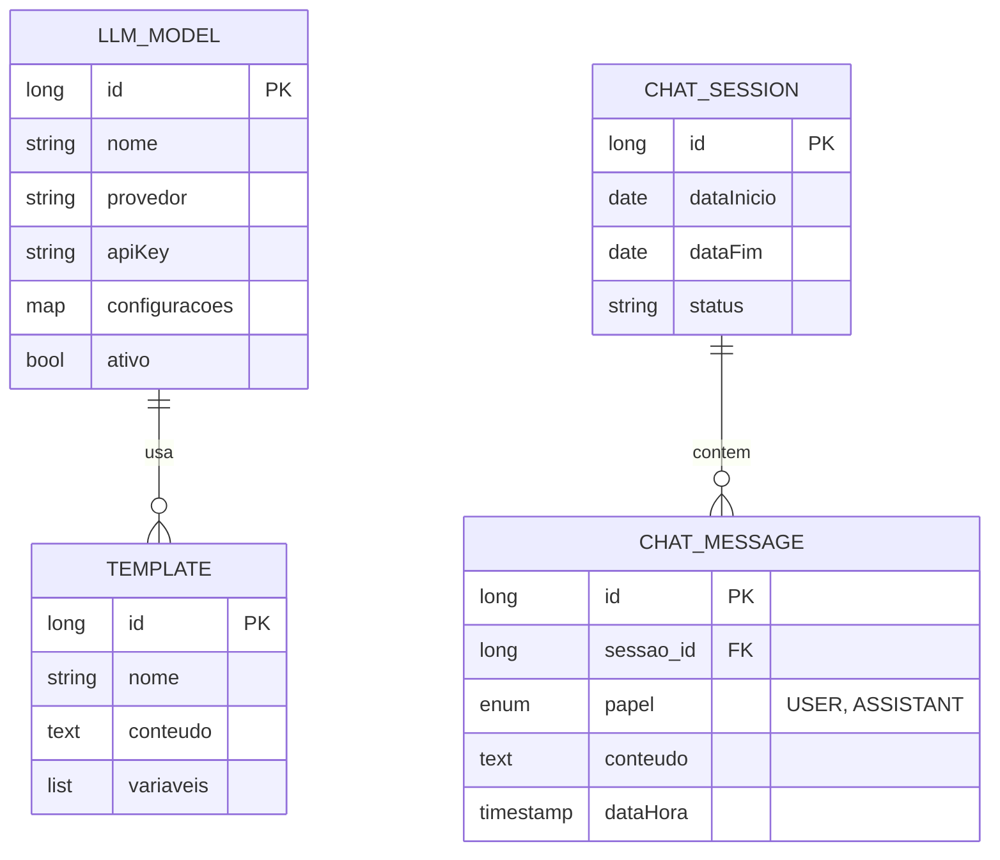

# CDU - GerenciarLLM

## 1. Descrição do Caso de Uso

O caso de uso "Gerenciar LLM" permite a configuração e utilização de Modelos de Linguagem de Grande Escala (LLM) no sistema. Fornece funcionalidades para聊天 (chat), criação de templates de prompts e gerenciamento de sessões de conversation.

## 2. Atores

| Ator | Descrição |
|------|------------|
| Administrador | Configura modelos LLM |
| Desenvolvedor | Cria templates de prompts |
| Usuário Final | Interage via chat |

## 3. Fluxo Principal

### 3.1. Fluxo: Configurar Modelo LLM

1. Administrador acessa configuração de LLM.
2. Sistema exibe modelos disponíveis.
3. Administrador seleciona provedor (OpenAI, Anthropic, etc).
4. Administrador configura API key e parâmetros.
5. Sistema valida conexão.
6. Sistema salva configuração.
7. Sistema exibe sucesso.

### 3.2. Fluxo: Criar Template de Prompt

1. Desenvolvedor acessa "Templates".
2. Sistema exibe lista de templates.
3. Desenvolvedor cria novo template.
4. Preenche: nome, descrição, variáveis, conteúdo.
5. Sistema valida template.
6. Sistema salva.
7. Sistema exibe sucesso.

### 3.3. Fluxo: Iniciar Sessão de Chat

1. Usuário acessa chat.
2. Sistema cria nova sessão.
3. Usuário envia mensagem.
4. Sistema processa via LLM.
5. Sistema exibe resposta.
6. Repetir 3-5 para continuar conversation.

### 3.4. Fluxo: Listar Histórico de Conversas

1. Usuário acessa histórico.
2. Sistema exibe conversas anteriores.
3. Usuário seleciona conversa.
4. Sistema carrega mensagens.

## 4. Fluxos Alternativos

### 4.1. Erro na API LLM

1. Sistema detecta erro na chamada API.
2. Sistema exibe mensagem de erro amigável.
3. Sistema registra erro para análise.

### 4.2. Limite de Tokens Excedido

1. Sistema detecta excesso de tokens.
2. Sistema trunca conversation mais antiga.
3. Continua processamento.

## 5. Fluxos de Navegação (Mestre-Detalhe)

### 5.1. Gerenciar Parâmetros do Modelo

1. A partir do formulário de modelo, o ator acessa "Parâmetros".
2. Sistema exibe lista de parâmetros configuráveis.
3. Ator ajusta: temperatura, top_p, max_tokens, etc.
4. Sistema salva configurações.
5. Configurações são aplicadas a todas as requisições.

### 5.2. Gerenciar Variáveis de Template

1. A partir do formulário de template, o ator acessa "Variáveis".
2. Sistema exibe lista de variáveis definidas.
3. Ator adiciona nova variável (nome, tipo, valor padrão).
4. Sistema valida nome único.
5. Sistema adiciona à lista.
6. Ator pode editar ou remover variáveis.

### 5.3. Gerenciar Mensagens da Sessão

1. A partir de uma sessão de chat, o ator visualiza mensagens.
2. Sistema exibe lista de mensagens (usuário e assistente).
3. Ator pode copiar mensagem.
4. Ator pode reiniciar sessão.
5. Sistema limpa histórico e cria nova sessão.

## 6. Regras de Negócio

| Regra | Descrição |
|-------|-----------|
| RN001 | Cada provedor LLM tem configurações específicas |
| RN002 | Templates suportam variáveis no formato ${variavel} |
| RN003 | Histórico de chat é persistido |
| RN004 | Sessões podem ser retomadas |
| RN005 | Taxa de requisições pode ser limitada |

## 7. Estrutura de Dados

## 8. Contratos de Interface

### 8.1. Interface REST - Modelo

| Método | Endpoint | Descrição |
|--------|----------|------------|
| GET | `/api/v1/llm/modelos` | Lista modelos |
| POST | `/api/v1/llm/modelos` | Cria modelo |
| GET | `/api/v1/llm/modelos/{id}` | Busca modelo |
| PUT | `/api/v1/llm/modelos/{id}` | Atualiza modelo |
| DELETE | `/api/v1/llm/modelos/{id}` | Remove modelo |
| PUT | `/api/v1/llm/modelos/{id}/ativar` | Ativa modelo |

### 8.2. Interface REST - Template

| Método | Endpoint | Descrição |
|--------|----------|------------|
| GET | `/api/v1/llm/templates` | Lista templates |
| POST | `/api/v1/llm/templates` | Cria template |
| GET | `/api/v1/llm/templates/{id}` | Busca template |
| PUT | `/api/v1/llm/templates/{id}` | Atualiza template |
| DELETE | `/api/v1/llm/templates/{id}` | Remove template |
| GET | `/api/v1/llm/templates/{id}/variaveis` | Lista variáveis |

### 8.3. Interface REST - Chat

| Método | Endpoint | Descrição |
|--------|----------|------------|
| POST | `/api/v1/llm/chat` | Envia mensagem |
| GET | `/api/v1/llm/sessoes` | Lista sessões |
| GET | `/api/v1/llm/sessoes/{id}` | Busca sessão |
| GET | `/api/v1/llm/sessoes/{id}/mensagens` | Lista mensagens |
| DELETE | `/api/v1/llm/sessoes/{id}` | Remove sessão |
