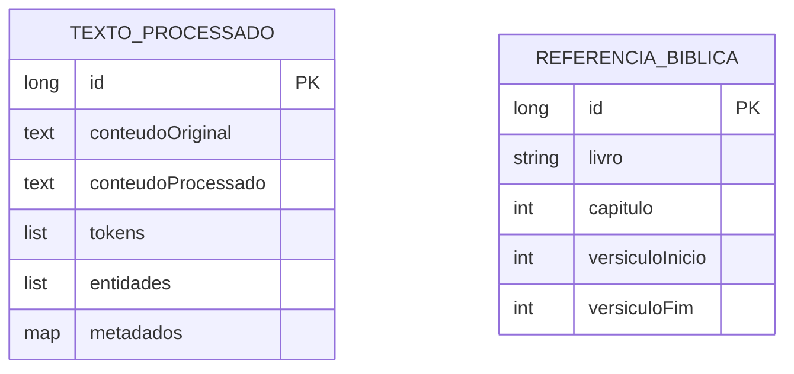

# CDU - Processar NLP

## 1. Descrição do Caso de Uso

O caso de uso "Processar NLP" fornece funcionalidades de Processamento de Linguagem Natural, incluindo tokenização, extração de entidades, análise de sentimentos e parsing de textos litúrgicos.

## 2. Atores

| Ator | Descrição |
|------|------------|
| Sistema | Utiliza automaticamente |
| Administrador | Configura modelos |

## 3. Fluxo Principal

### 3.1. Tokenizar Texto

1. Sistema envia texto para processamento.
2. Sistema aplica tokenizer.
3. Retorna lista de tokens.

### 3.2. Extrair Entidades

1. Sistema envia texto.
2. Sistema identifica entidades:
   - Pessoas
   - Locais
   - Datas
   - Números
3. Retorna entidades identificadas.

### 3.3. Processar Texto Litúrgico

1. Sistema envia texto de leitura.
2. Sistema parseia estrutura.
3. Extrai referências bíblicas.
4. Identifica versículos.
5. Retorna estrutura processada.

## 4. Estrutura de Dados



## 5. Contratos de Interface

### 5.1. Interface REST
```
POST   /api/v1/nlp/tokenizar
POST   /api/v1/nlp/extrair-entidades
POST   /api/v1/nlp/processar-leitura
```

### 5.2. Interface de Serviço
- `tokenizar(texto)`: Retorna tokens
- `extrairEntidades(texto)`: Retorna entidades
- `processarLeitura(texto)`: Processa texto litúrgico
