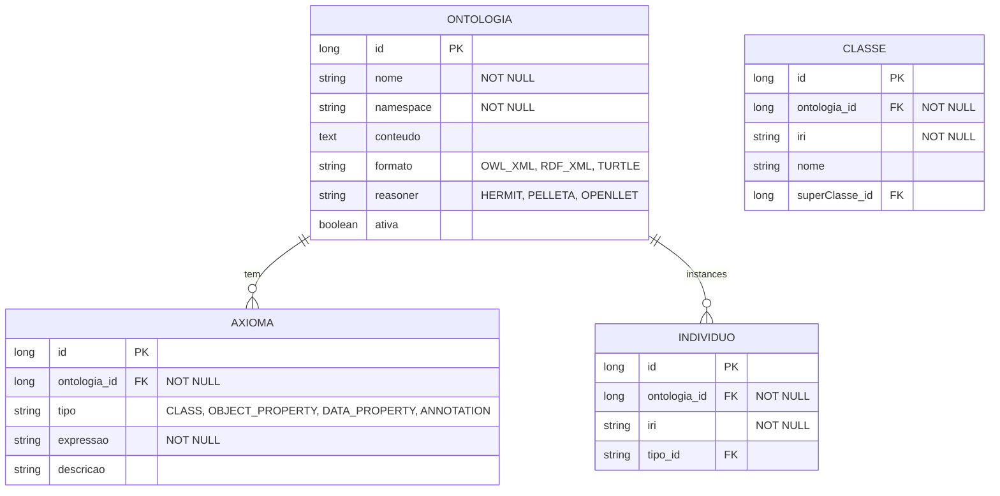

# CDU - Manter OWL

## 1. Descrição do Caso de Uso

O caso de uso "Manter OWL" gerencia as ontologias OWL utilizadas para raciocínio lógico e representação de conhecimento. Permite criar, editar e consultar ontologias.

## 2. Atores

| Ator | Descrição |
|------|------------|
| Desenvolvedor | Cria ontologias |
| Analista de Conhecimento | Modela conceitos |
| Usuário | Consulta ontologia |

## 3. Fluxo Principal

### 3.1. Fluxo: Criar Ontologia

1. Ator acessa "Nova Ontologia".
2. Sistema exibe formulário.
3. Ator define nome e namespace.
4. Ator carrega arquivo OWL (OWL/XML, RDF/XML, Turtle).
5. Sistema parseia ontologia.
6. Sistema salva no repositório.

### 3.2. Fluxo: Adicionar Axioma

1. Ator seleciona ontologia.
2. Acessa "Novo Axioma".
3. Sistema exibe editor.
4. Ator define axioma (classe, propriedade, indivíduo).
5. Sistema valida sintaxe OWL.
6. Sistema adiciona axioma.

### 3.3. Fluxo: Consultar Inferências

1. Ator acessa ontologia.
2. Define consulta.
3. Sistema executa reasoner.
4. Sistema retorna inferências.

## 4. Fluxos Alternativos

### 4.1. Ontologia Inválida

1. Sistema detecta erro de sintaxe.
2. Exibe mensagem com linha.
3. Ator corrige.

### 4.2. Reasoner Inconsistente

1. Sistema detecta inconsistência.
2. Exibe informações.
3. Ator resolve conflitos.

## 5. Fluxos de Navegação (Mestre-Detalhe)

### 5.1. Gerenciar Classes

1. A partir da ontologia, ator acessa "Classes".
2. Sistema exibe hierarquia.
3. Ator adiciona/edita classes.
4. Sistema valida.

### 5.2. Gerenciar Propriedades

1. A partir da ontologia, ator acessa "Propriedades".
2. Sistema exibe lista.
3. Ator configura relações.
4. Sistema atualiza.

### 5.3. Visualizar Indivíduos

1. A partir da ontologia, ator acessa "Indivíduos".
2. Sistema exibe instâncias.
3. Ator consulta detalhes.

## 6. Regras de Negócio

| Regra | Descrição |
|-------|-----------|
| RN001 | Nome é obrigatório |
| RN002 | Namespace deve ser válido |
| RN003 | Arquivo deve ser formato válido |
| RN004 | Axiomas devem ser sintaticamente válidos |
| RN005 | Reasoner deve ser selecionado |

## 7. Estrutura de Dados

## 8. Contratos de Interface

### 8.1. Interface REST

| Método | Endpoint | Descrição |
|--------|----------|------------|
| GET | `/api/v1/ontologias` | Lista ontologias |
| POST | `/api/v1/ontologias` | Cria ontologia |
| GET | `/api/v1/ontologias/{id}` | Busca ontologia |
| PUT | `/api/v1/ontologias/{id}` | Atualiza ontologia |
| DELETE | `/api/v1/ontologias/{id}` | Exclui ontologia |
| POST | `/api/v1/ontologias/{id}/axioma` | Adiciona axioma |
| POST | `/api/v1/ontologias/{id}/inferir` | Consulta inferências |

### 8.2. Endpoints de Relacionamento

| Método | Endpoint | Descrição |
|--------|----------|------------|
| GET | `/api/v1/ontologias/{id}/classes` | Lista classes |
| GET | `/api/v1/ontologias/{id}/propriedades` | Lista propriedades |
| GET | `/api/v1/ontologias/{id}/individuos` | Lista indivíduos |
| GET | `/api/v1/ontologias/{id}/hierarquia` | Exibe hierarquia |
