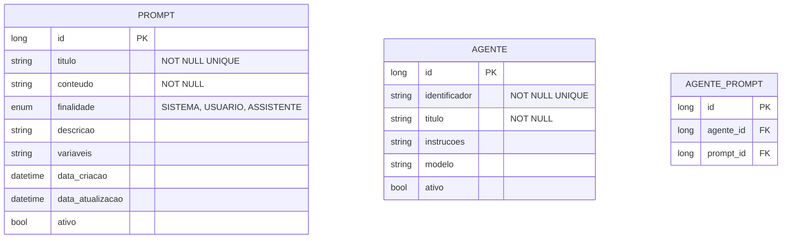

# CDU - Manter Prompt

## 1. Descrição do Caso de Uso

O caso de uso "Manter Prompt" permite o cadastro, consulta, alteração e exclusão de prompts no sistema ia-core-llm. Um prompt representa um conjunto de instruções ou texto que pode ser usado por agentes LLM para guiar suas respostas. Este módulo permite a gestão de prompts para diferentes finalidades (sistema, usuário, assistente) e contextos.

## 2. Atores

| Ator          | Descrição                                    |
|---------------|----------------------------------------------|
| Administrador | Usuário com acesso total ao sistema          |
| Desenvolvedor | Usuário responsável por criar prompts         |
| Usuário       | Usuário comum que pode visualizar prompts      |

## 3. Fluxo Principal

### 3.1. Fluxo: Cadastrar Prompt

1. O ator acessa a opção "Cadastrar Prompt" no menu.
2. O sistema exibe o formulário de cadastro de prompt.
3. O ator preenche os dados obrigatórios (título, conteúdo, finalidade).
4. O ator seleciona a finalidade do prompt (SISTEMA, USUARIO, ASSISTENTE).
5. O ator preenche os dados opcionais (descrição, variáveis).
6. O ator confirma o cadastro.
7. O sistema valida os dados:
    - Verifica se o título já está cadastrado
    - Verifica se o conteúdo não está vazio
    - Verifica se as variáveis estão corretamente formatadas
8. O sistema salva o prompt no banco de dados.
9. O sistema exibe a mensagem de sucesso e os dados cadastrados.

### 3.2. Fluxo: Consultar Prompt

1. O ator acessa a opção "Consultar Prompt" no menu.
2. O sistema exibe a tela de pesquisa com filtros.
3. O ator informa os critérios de pesquisa (título, finalidade).
4. O sistema retorna a lista de prompts que atendem aos critérios.
5. O ator seleciona um prompt da lista.
6. O sistema exibe os dados detalhados do prompt:
    - Título
    - Conteúdo
    - Finalidade
    - Descrição
    - Variáveis
    - Data de cadastro

### 3.3. Fluxo: Alterar Prompt

1. O ator acessa a opção "Consultar Prompt" e seleciona um prompt.
2. O ator clica no botão "Editar".
3. O sistema exibe o formulário de alteração com os dados preenchidos.
4. O ator modifica os dados desejados (conteúdo, descrição, variáveis).
5. O ator confirma a alteração.
6. O sistema valida e salva as alterações.
7. O sistema exibe a mensagem de sucesso.

### 3.4. Fluxo: Excluir Prompt

1. O ator acessa a opção "Consultar Prompt" e seleciona um prompt.
2. O ator clica no botão "Excluir".
3. O sistema solicita confirmação.
4. O ator confirma a exclusão.
5. O sistema verifica se há dependências (agentes ativos que utilizam este prompt).
6. Se não houver dependências, o sistema exclui o prompt.
7. O sistema exibe a mensagem de sucesso.
8. Se houver dependências, o sistema exibe mensagem de erro indicando as dependências.

## 4. Fluxos Alternativos

### 4.1. Prompt com Título Duplicado

1. No passo 7 do fluxo principal (Cadastrar), o sistema detecta título duplicado.
2. O sistema exibe mensagem de erro indicando que o título já está cadastrado.
3. O fluxo retorna ao passo 3.

### 4.2. Prompt com Conteúdo Vazio

1. No passo 7 do fluxo principal (Cadastrar), o sistema detecta que o conteúdo está vazio.
2. O sistema exibe mensagem de erro indicando que o conteúdo é obrigatório.
3. O fluxo retorna ao passo 3.

### 4.3. Prompt com Dependências

1. No passo 5 do fluxo de exclusão, o sistema detecta dependências.
2. O sistema exibe lista dos agentes que utilizam este prompt.
3. O ator deve remover o prompt dos agentes antes de excluí-lo.

## 5. Fluxos de Navegação (Mestre-Detalhe)

### 5.1. Visualizar Versões do Prompt

1. A partir da tela de detalhe do prompt, o ator clica em "Histórico".
2. O sistema exibe o histórico de versões do prompt.
3. O ator pode restaurar uma versão anterior.

### 5.2. Testar Prompt

1. A partir da tela de detalhe do prompt, o ator clica em "Testar".
2. O sistema exibe uma interface de teste.
3. O ator insere variáveis de teste.
4. O sistema aplica o prompt e exibe o resultado.

### 5.3. Clonar Prompt

1. A partir da tela de detalhe do prompt, o ator clica em "Clonar".
2. O sistema cria uma cópia do prompt.
3. O ator pode modificar a cópia conforme necessário.

## 6. Regras de Negócio

| Regra | Descrição                                                         |
|-------|-------------------------------------------------------------------|
| RN001 | O título é obrigatório e deve ser único                           |
| RN002 | O conteúdo é obrigatório e não pode estar vazio                   |
| RN003 | A finalidade pode ser: SISTEMA, USUARIO, ASSISTENTE              |
| RN004 | Variáveis devem seguir o formato {{nome_variavel}}                |
| RN005 | Prompts não podem ser excluídos se estiverem em uso por agentes   |
| RN006 | O sistema mantém histórico de versões dos prompts                 |
| RN007 | Prompts de finalidade SISTEMA são usados para instruções do agente |

## 7. Estrutura de Dados

## 8. Contratos de Interface

### 8.1. Interface REST

| Método | Endpoint                      | Descrição                      |
|--------|-------------------------------|--------------------------------|
| GET    | `/api/v1/llm/prompts`         | Lista prompts com paginação     |
| GET    | `/api/v1/llm/prompts/{id}`    | Busca prompt por ID            |
| POST   | `/api/v1/llm/prompts`         | Cadastra novo prompt           |
| PUT    | `/api/v1/llm/prompts/{id}`    | Atualiza prompt               |
| DELETE | `/api/v1/llm/prompts/{id}`    | Exclui prompt                 |
| GET    | `/api/v1/llm/prompts/search`  | Pesquisa por critérios        |
| POST   | `/api/v1/llm/prompts/{id}/testar` | Testa prompt com variáveis |

### 8.2. Endpoints de Relacionamento

| Método | Endpoint                              | Descrição                 |
|--------|---------------------------------------|---------------------------|
| GET    | `/api/v1/llm/prompts/{id}/agentes`   | Lista agentes que utilizam |
| POST   | `/api/v1/llm/prompts/{id}/agentes/{agenteId}` | Vincula a agente |
| DELETE | `/api/v1/llm/prompts/{id}/agentes/{agenteId}` | Remove de agente |
| GET    | `/api/v1/llm/prompts/{id}/historico` | Lista histórico de versões |

## 9. Casos de Extensão

| Caso de Uso        | Descrição                                      |
|--------------------|------------------------------------------------|
| Manter Agente      | Um prompt pode ser utilizado por agentes        |
| Sessão Chat        | Prompts são usados em sessões de chat           |
| Interface Agente Conversacional | Prompts guiam as respostas dos agentes |
