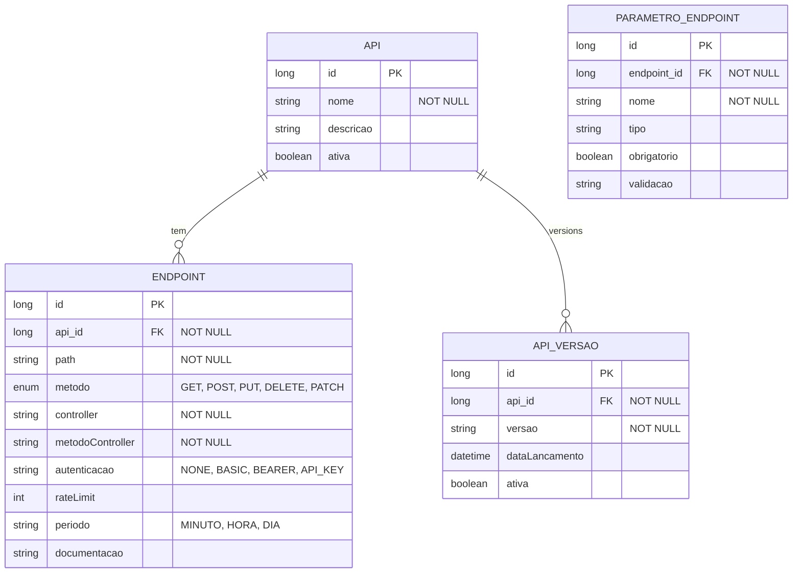

# CDU - Manter REST

## 1. Descrição do Caso de Uso

O caso de uso "Manter REST" gerencia as APIs REST expostas pelo sistema. Permite configurar endpoints, versionamento, documentação e políticas de acesso.

## 2. Atores

| Ator | Descrição |
|------|------------|
| Desenvolvedor | Cria e mantém APIs |
| Administrador | Configura acesso |
| Consumidor | Consome APIs |

## 3. Fluxo Principal

### 3.1. Fluxo: Criar Endpoint

1. Ator acessa "Novo Endpoint".
2. Sistema exibe formulário.
3. Ator define path.
4. Ator seleciona método (GET, POST, PUT, DELETE).
5. Ator define controller e método.
6. Ator define parâmetros.
7. Sistema registra endpoint.

### 3.2. Fluxo: Versionar API

1. Ator acessa API.
2. Clica em "Nova Versão".
3. Sistema cria versão.
4. Ator configura diferenças.
5. Sistema mantém versões paralelas.

### 3.3. Fluxo: Documentar Endpoint

1. Ator acessa endpoint.
2. Acessa "Documentação".
3. Ator escreve descrição.
4. Ator define exemplos.
5. Sistema gera OpenAPI.

## 4. Fluxos Alternativos

### 4.1. Conflito de Path

1. Sistema detecta path duplicado.
2. Exibe erro.
3. Ator corrige.

### 4.2. Método Não Encontrado

1. Sistema não encontra método.
2. Exibe erro de configuração.
3. Ator corrige mapeamento.

## 5. Fluxos de Navegação (Mestre-Detalhe)

### 5.1. Gerenciar Parâmetros

1. A partir do endpoint, ator acessa "Parâmetros".
2. Sistema exibe lista.
3. Ator configura validações.
4. Sistema registra.

### 5.2. Configurar Autenticação

1. A partir do endpoint, ator acessa "Autenticação".
2. Define tipo (NONE, BASIC, BEARER, API_KEY).
3. Sistema aplica configuração.

### 5.3. Rate Limiting

1. A partir do endpoint, ator acessa "Limites".
2. Define número de requisições.
3. Define período.
4. Sistema aplica limits.

## 6. Regras de Negócio

| Regra | Descrição |
|-------|-----------|
| RN001 | Path deve ser único |
| RN002 | Método é obrigatório |
| RN003 | Controller e método são obrigatórios |
| RN004 | Versão deve seguir formato semântico |
| RN005 | Documentação é opcional |

## 7. Estrutura de Dados

## 8. Contratos de Interface

### 8.1. Interface REST

| Método | Endpoint | Descrição |
|--------|----------|------------|
| GET | `/api/v1/apis` | Lista APIs |
| POST | `/api/v1/apis` | Cria API |
| GET | `/api/v1/apis/{id}` | Busca API |
| PUT | `/api/v1/apis/{id}` | Atualiza API |
| DELETE | `/api/v1/apis/{id}` | Exclui API |
| GET | `/api/v1/apis/{id}/openapi` | Gera OpenAPI |

### 8.2. Endpoints de Relacionamento

| Método | Endpoint | Descrição |
|--------|----------|------------|
| GET | `/api/v1/apis/{id}/endpoints` | Lista endpoints |
| POST | `/api/v1/apis/{id}/endpoints` | Adiciona endpoint |
| GET | `/api/v1/apis/{id}/versoes` | Lista versões |
| POST | `/api/v1/apis/{id}/versoes` | Cria versão |
