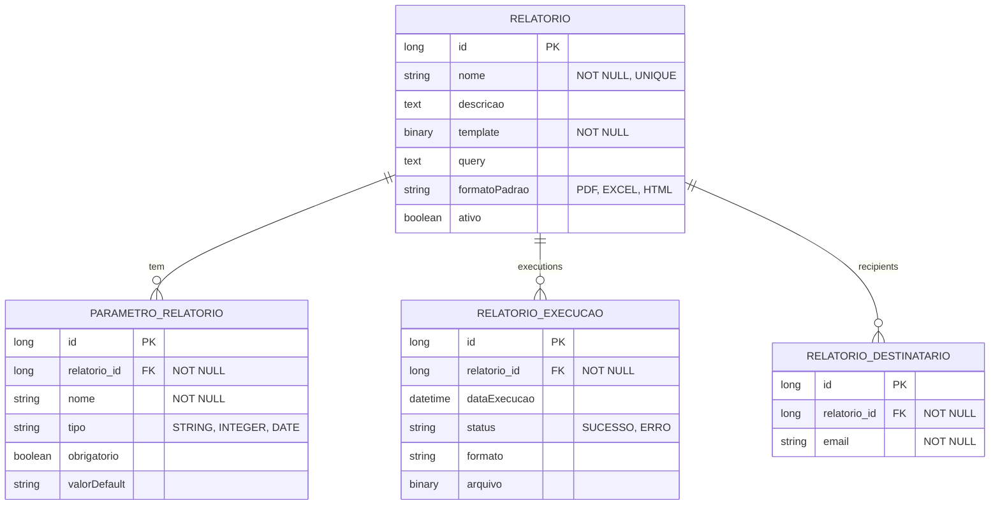

# CDU - Manter Report

## 1. Descrição do Caso de Uso

O caso de uso "Manter Report" gerencia os relatórios do sistema. Permite criar, editar e executar relatórios utilizando JasperReports ou similar.

## 2. Atores

| Ator | Descrição |
|------|------------|
| Administrador | Gerencia relatórios |
| Desenvolvedor | Cria templates |
| Usuário | Executa relatórios |

## 3. Fluxo Principal

### 3.1. Fluxo: Criar Relatório

1. Ator acessa "Novo Relatório".
2. Sistema exibe formulário.
3. Ator define nome.
4. Ator carrega arquivo de template (.jrxml).
5. Ator define parâmetros.
6. Ator define query SQL.
7. Sistema compila relatório.
8. Sistema salva.

### 3.2. Fluxo: Executar Relatório

1. Ator acessa lista de relatórios.
2. Seleciona relatório.
3. Sistema exibe parâmetros.
4. Ator preenche parâmetros.
5. Ator seleciona formato (PDF, EXCEL, HTML).
6. Sistema gera relatório.
7. Sistema retorna arquivo.

### 3.3. Fluxo: Agendar Relatório

1. Ator acessa relatório.
2. Clica em "Agendar".
3. Sistema exibe configurações.
4. Ator define periodicidade.
5. Ator define destinatários.
6. Sistema agenda execução.

## 4. Fluxos Alternativos

### 4.1. Erro na Query

1. Sistema detecta erro na query.
2. Exibe mensagem de erro.
3. Ator corrige.

### 4.2. Parâmetro Obrigatório

1. Ator tenta executar sem parâmetro obrigatório.
2. Sistema exibe erro.
3. Ator informa valor.

## 5. Fluxos de Navegação (Mestre-Detalhe)

### 5.1. Gerenciar Parâmetros

1. A partir do relatório, ator acessa "Parâmetros".
2. Sistema exibe lista.
3. Ator adiciona/edita parâmetros.
4. Sistema valida.

### 5.2. Visualizar Histórico

1. A partir do relatório, ator acessa "Histórico".
2. Sistema exibe execuções anteriores.
3. Ator pode baixar relatórios gerados.

### 5.3. Configurar Destinatários

1. A partir do relatório, ator acessa "Destinatários".
2. Sistema exibe lista de emails.
3. Ator adiciona destinatários.
4. Sistema salva configurações.

## 6. Regras de Negócio

| Regra | Descrição |
|-------|-----------|
| RN001 | Nome é obrigatório e único |
| RN002 | Template é obrigatório |
| RN003 | Query deve ser válida |
| RN004 | Parâmetros podem ser obrigatórios ou opcionais |
| RN005 | Formato padrão pode ser definido |

## 7. Estrutura de Dados

## 8. Contratos de Interface

### 8.1. Interface REST

| Método | Endpoint | Descrição |
|--------|----------|------------|
| GET | `/api/v1/reports` | Lista relatórios |
| POST | `/api/v1/reports` | Cria relatório |
| GET | `/api/v1/reports/{id}` | Busca relatório |
| PUT | `/api/v1/reports/{id}` | Atualiza relatório |
| DELETE | `/api/v1/reports/{id}` | Exclui relatório |
| POST | `/api/v1/reports/{id}/execute` | Executa relatório |
| POST | `/api/v1/reports/{id}/schedule` | Agenda relatório |

### 8.2. Endpoints de Relacionamento

| Método | Endpoint | Descrição |
|--------|----------|------------|
| GET | `/api/v1/reports/{id}/parametros` | Lista parâmetros |
| POST | `/api/v1/reports/{id}/parametros` | Adiciona parâmetro |
| GET | `/api/v1/reports/{id}/execucoes` | Lista execuções |
| GET | `/api/v1/reports/{id}/download/{execucaoId}` | Baixa execução |
