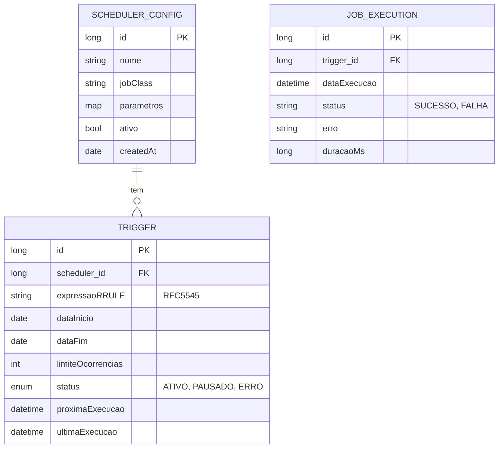

# CDU - Gerenciar Scheduler

## 1. Descrição do Caso de Uso

O caso de uso "Gerenciar Scheduler" permite o agendamento e execução de tarefas periódicas no sistema. Utiliza o padrão RFC5545 para definição de periodicidades e gerencia a execução de jobs.

## 2. Atores

| Ator | Descrição |
|------|------------|
| Administrador | Configura agendamentos |
| Desenvolvedor | Cria jobs |

## 3. Fluxo Principal

### 3.1. Fluxo: Criar Agendamento

1. Administrador acessa "Novo Agendamento".
2. Sistema exibe formulário.
3. Administrador seleciona job a executar.
4. Define periodicidade:
   - Frequência (diária, semanal, mensal, anual)
   - Intervalo
   - Dias da semana
   - Data início e fim
5. Define parâmetros do job.
6. Sistema valida periodicidade RFC5545.
7. Sistema cria scheduler.
8. Sistema agenda execução.
9. Sistema exibe sucesso.

### 3.2. Fluxo: Listar Agendamentos

1. Administrador acessa lista de agendamentos.
2. Sistema exibe todos os schedulers.
3. Mostra próxima execução de cada um.
4. Mostra status (ativo, pausado, erro).

### 3.3. Fluxo: Pausar/Retomar Agendamento

1. Administrador seleciona agendamento.
2. Clica em pausar/retomar.
3. Sistema atualiza status.
4. Sistema exibe sucesso.

### 3.4. Fluxo: Excluir Agendamento

1. Administrador seleciona agendamento.
2. Clica em excluir.
3. Sistema solicita confirmação.
4. Remove agendamento.
5. Cancela execuções futuras.

## 4. Fluxos Alternativos

### 4.1. Erro na Execução

1. Job falha durante execução.
2. Sistema registra erro.
3. Sistema notifica administrador.
4. Scheduler permanece ativo (para próximas tentativas).

### 4.2. Periodicidade Inválida

1. Administrador define periodicidade inválida.
2. Sistema exibe erro de validação.
3. Retorna ao formulário.

## 5. Fluxos de Navegação (Mestre-Detalhe)

### 5.1. Configurar Trigger

1. A partir do formulário de scheduler, o ator acessa "Trigger".
2. Sistema exibe configurações de trigger.
3. Ator define: frequência, intervalo, dias, início, fim.
4. Sistema valida RFC5545.
5. Sistema salva trigger.

### 5.2. Visualizar Execuções

1. A partir da lista de agendamentos, ator seleciona um.
2. Acessa "Histórico de Execuções".
3. Sistema exibe lista de execuções.
4. Mostra data, status, duração, erro (se houver).
5. Ator pode filtrar por status e período.

### 5.3. Configurar Parâmetros do Job

1. A partir do formulário, ator acessa "Parâmetros".
2. Sistema exibe campos de parâmetros.
3. Ator define: chave-valor para o job.
4. Sistema salva parâmetros.
5. Parâmetros são passados ao job na execução.

### 5.4. Gerenciar Exceções

1. A partir do scheduler, ator acessa "Exceções".
2. Sistema exibe datas excluídas.
3. Ator adiciona data de exceção.
4. Sistema adiciona à lista.
5. Execuções são recalculadas.

## 6. Regras de Negócio

| Regra | Descrição |
|-------|-----------|
| RN001 | Periodicidade segue padrão RFC5545 |
| RN002 | Data de início é obrigatória |
| RN003 | Job deve estar implementado no sistema |
| RN004 | Execuções falhadas são registradas |
| RN005 | Agendamentos podem ter até 1000 execuções futuras |

## 7. Estrutura de Dados

## 8. Contratos de Interface

### 8.1. Interface REST

| Método | Endpoint | Descrição |
|--------|----------|------------|
| GET | `/api/v1/schedulers` | Lista agendamentos |
| POST | `/api/v1/schedulers` | Cria agendamento |
| GET | `/api/v1/schedulers/{id}` | Busca agendamento |
| PUT | `/api/v1/schedulers/{id}` | Atualiza agendamento |
| DELETE | `/api/v1/schedulers/{id}` | Exclui agendamento |
| PUT | `/api/v1/schedulers/{id}/pausar` | Pausa agendamento |
| PUT | `/api/v1/schedulers/{id}/retomar` | Retoma agendamento |

### 8.2. Endpoints de Relacionamento

| Método | Endpoint | Descrição |
|--------|----------|------------|
| GET | `/api/v1/schedulers/{id}/trigger` | Busca trigger |
| PUT | `/api/v1/schedulers/{id}/trigger` | Atualiza trigger |
| GET | `/api/v1/schedulers/{id}/execucoes` | Lista execuções |
| GET | `/api/v1/schedulers/{id}/parametros` | Busca parâmetros |
| PUT | `/api/v1/schedulers/{id}/parametros` | Atualiza parâmetros |
