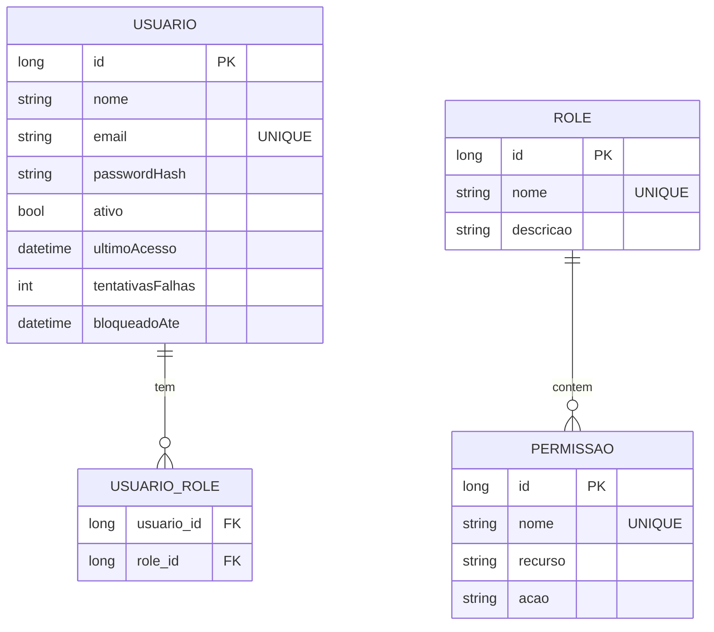

# CDU - Gerenciar Segurança

## 1. Descrição do Caso de Uso

O caso de uso "Gerenciar Segurança" fornece funcionalidades de autenticação, autorização e gerenciamento de usuários e permissões no sistema.

## 2. Atores

| Ator | Descrição |
|------|------------|
| Administrador | Gerencia usuários e permissões |
| Usuário | Acessa o sistema |

## 3. Fluxo Principal

### 3.1. Fluxo: Autenticar Usuário

1. Usuário acessa tela de login.
2. Fornece credenciais (email/senha).
3. Sistema valida credenciais.
4. Sistema cria sessão.
5. Sistema redireciona para página principal.

### 3.2. Fluxo: Registrar Novo Usuário

1. Administrador acessa "Novo Usuário".
2. Preenche dados: nome, email, senha.
3. Sistema valida email único.
4. Criptografa senha.
5. Cria usuário.
6. Sistema exibe sucesso.

### 3.3. Fluxo: Atribuir Permissões

1. Administrador seleciona usuário.
2. Acessa "Permissões".
3. Seleciona papéis (roles).
4. Sistema associa permissões.
5. Usuário herda permissões.

### 3.4. Fluxo: Recuperar Senha

1. Usuário acessa "Esqueci minha senha".
2. Fornece email.
3. Sistema verifica email existente.
4. Envia token de reset.
5. Usuário define nova senha.

## 4. Fluxos Alternativos

### 4.1. Credenciais Inválidas

1. Sistema detecta credenciais incorretas.
2. Sistema incrementa tentativas falhas.
3. Após 5 tentativas, bloqueia temporariamente.

### 4.2. Token Expirado

1. Token de reset expirou.
2. Sistema exibe mensagem.
3. Usuário solicita novo token.

## 5. Fluxos de Navegação (Mestre-Detalhe)

### 5.1. Gerenciar Roles do Usuário

1. A partir do formulário de usuário, ator acessa "Roles".
2. Sistema exibe lista de roles disponíveis.
3. Ator seleciona roles.
4. Sistema vincula roles ao usuário.
5. Ator pode remover roles.

### 5.2. Gerenciar Permissões de Role

1. A partir da lista de roles, ator seleciona uma role.
2. Acessa "Permissões".
3. Sistema exibe lista de permissões disponíveis.
4. Ator seleciona permissões (criar, ler, atualizar, excluir).
5. Sistema vincula permissões à role.

### 5.3. Gerenciar Usuários por Role

1. A partir de uma role, ator acessa "Usuários".
2. Sistema exibe usuários com essa role.
3. Ator pode adicionar ou remover usuários.

### 5.4. Configurar Sessão

1. A partir do formulário de usuário, ator acessa "Configurações de Sessão".
2. Sistema exibe: tempo de expiração, IP permitido, etc.
3. Ator ajusta configurações.
4. Sistema salva.

## 6. Regras de Negócio

| Regra | Descrição |
|-------|-----------|
| RN001 | Senha deve ter mínimo 8 caracteres |
| RN002 | Email deve ser único |
| RN003 | Sessão expira após 30 minutos de inatividade |
| RN004 | Após 5 tentativas falhas, bloqueio por 15 min |
| RN005 | Roles podem ser hierárquicas |
| RN006 | Permissões seguem padrão RBAC |

## 7. Estrutura de Dados

## 8. Contratos de Interface

### 8.1. Interface REST - Autenticação

| Método | Endpoint | Descrição |
|--------|----------|------------|
| POST | `/api/v1/auth/login` | Autentica usuário |
| POST | `/api/v1/auth/logout` | Encerra sessão |
| POST | `/api/v1/auth/esqueci-senha` | Solicita reset |
| POST | `/api/v1/auth/resetar-senha` | Reseta senha |

### 8.2. Interface REST - Usuários

| Método | Endpoint | Descrição |
|--------|----------|------------|
| GET | `/api/v1/usuarios` | Lista usuários |
| POST | `/api/v1/usuarios` | Cria usuário |
| GET | `/api/v1/usuarios/{id}` | Busca usuário |
| PUT | `/api/v1/usuarios/{id}` | Atualiza usuário |
| DELETE | `/api/v1/usuarios/{id}` | Remove usuário |
| PUT | `/api/v1/usuarios/{id}/ativar` | Ativa usuário |
| PUT | `/api/v1/usuarios/{id}/bloquear` | Bloqueia usuário |

### 8.3. Interface REST - Roles

| Método | Endpoint | Descrição |
|--------|----------|------------|
| GET | `/api/v1/roles` | Lista roles |
| POST | `/api/v1/roles` | Cria role |
| GET | `/api/v1/roles/{id}` | Busca role |
| PUT | `/api/v1/roles/{id}` | Atualiza role |
| DELETE | `/api/v1/roles/{id}` | Remove role |

### 8.4. Endpoints de Relacionamento

| Método | Endpoint | Descrição |
|--------|----------|------------|
| GET | `/api/v1/usuarios/{id}/roles` | Lista roles do usuário |
| POST | `/api/v1/usuarios/{id}/roles` | Adiciona role |
| DELETE | `/api/v1/usuarios/{id}/roles/{roleId}` | Remove role |
| GET | `/api/v1/roles/{id}/permissoes` | Lista permissões da role |
| POST | `/api/v1/roles/{id}/permissoes` | Adiciona permissão |
| DELETE | `/api/v1/roles/{id}/permissoes/{permId}` | Remove permissão |
| GET | `/api/v1/roles/{id}/usuarios` | Lista usuários da role |
