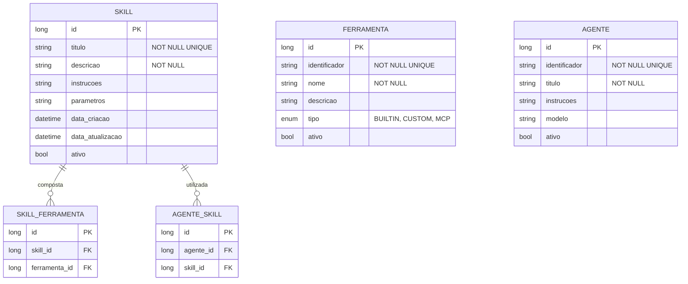

# CDU - Manter Skill

## 1. Descrição do Caso de Uso

O caso de uso "Manter Skill" permite o cadastro, consulta, alteração e exclusão de skills no sistema ia-core-llm. Uma skill representa uma capacidade especializada que um agente LLM pode executar (ex: análise de dados, geração de relatórios, processamento de imagens). Skills podem ser compostas por múltiplas ferramentas e podem ser ativadas dinamicamente durante uma conversação.

## 2. Atores

| Ator          | Descrição                                    |
|---------------|----------------------------------------------|
| Administrador | Usuário com acesso total ao sistema          |
| Desenvolvedor | Usuário responsável por criar skills          |
| Usuário       | Usuário comum que pode visualizar skills       |

## 3. Fluxo Principal

### 3.1. Fluxo: Cadastrar Skill

1. O ator acessa a opção "Cadastrar Skill" no menu.
2. O sistema exibe o formulário de cadastro de skill.
3. O ator preenche os dados obrigatórios (título, descrição).
4. O ator seleciona as ferramentas que compõem a skill.
5. O ator preenche os dados opcionais (instruções, parâmetros).
6. O ator confirma o cadastro.
7. O sistema valida os dados:
    - Verifica se o título já está cadastrado
    - Verifica se pelo menos uma ferramenta foi selecionada
    - Verifica se as ferramentas selecionadas estão disponíveis
8. O sistema salva a skill no banco de dados.
9. O sistema exibe a mensagem de sucesso e os dados cadastrados.

### 3.2. Fluxo: Consultar Skill

1. O ator acessa a opção "Consultar Skill" no menu.
2. O sistema exibe a tela de pesquisa com filtros.
3. O ator informa os critérios de pesquisa (título, ferramenta).
4. O sistema retorna a lista de skills que atendem aos critérios.
5. O ator seleciona uma skill da lista.
6. O sistema exibe os dados detalhados da skill:
    - Título
    - Descrição
    - Instruções
    - Ferramentas que compõem a skill
    - Agentes que utilizam esta skill
    - Parâmetros

### 3.3. Fluxo: Alterar Skill

1. O ator acessa a opção "Consultar Skill" e seleciona uma skill.
2. O ator clica no botão "Editar".
3. O sistema exibe o formulário de alteração com os dados preenchidos.
4. O ator modifica os dados desejados (descrição, instruções, ferramentas).
5. O ator confirma a alteração.
6. O sistema valida e salva as alterações.
7. O sistema exibe a mensagem de sucesso.

### 3.4. Fluxo: Excluir Skill

1. O ator acessa a opção "Consultar Skill" e seleciona uma skill.
2. O ator clica no botão "Excluir".
3. O sistema solicita confirmação.
4. O ator confirma a exclusão.
5. O sistema verifica se há dependências (agentes ativos que utilizam esta skill).
6. Se não houver dependências, o sistema exclui a skill.
7. O sistema exibe a mensagem de sucesso.
8. Se houver dependências, o sistema exibe mensagem de erro indicando as dependências.

## 4. Fluxos Alternativos

### 4.1. Skill com Título Duplicado

1. No passo 7 do fluxo principal (Cadastrar), o sistema detecta título duplicado.
2. O sistema exibe mensagem de erro indicando que o título já está cadastrado.
3. O fluxo retorna ao passo 3.

### 4.2. Skill sem Ferramentas

1. No passo 7 do fluxo principal (Cadastrar), o sistema detecta que nenhuma ferramenta foi selecionada.
2. O sistema exibe mensagem de erro indicando que pelo menos uma ferramenta é obrigatória.
3. O fluxo retorna ao passo 4.

### 4.3. Skill com Dependências

1. No passo 5 do fluxo de exclusão, o sistema detecta dependências.
2. O sistema exibe lista dos agentes que utilizam esta skill.
3. O ator deve remover a skill dos agentes antes de excluí-la.

## 5. Fluxos de Navegação (Mestre-Detalhe)

### 5.1. Gerenciar Ferramentas da Skill

1. A partir do formulário de skill (passo 4 do fluxo principal), o ator clica em "Adicionar Ferramenta".
2. O sistema exibe diálogo de seleção de ferramentas.
3. O ator seleciona as ferramentas desejadas.
4. O ator confirma.
5. O sistema adiciona as ferramentas à skill.
6. O ator pode remover ferramentas da lista.
7. Ao salvar a skill, as ferramentas também são persistidas.

### 5.2. Ativar Skill Dinamicamente

1. A partir de uma sessão de chat, o ator solicita ativação de uma skill.
2. O sistema exibe a lista de skills disponíveis.
3. O ator seleciona a skill a ser ativada.
4. O sistema ativa a skill para a sessão atual.
5. O sistema exibe confirmação da ativação.

### 5.3. Visualizar Metadados da Skill

1. A partir da tela de detalhe da skill, o ator clica em "Metadados".
2. O sistema exibe os metadados da skill:
    - Data de criação
    - Última atualização
    - Quantidade de ativações
    - Taxa de sucesso

## 6. Regras de Negócio

| Regra | Descrição                                                         |
|-------|-------------------------------------------------------------------|
| RN001 | O título é obrigatório e deve ser único                           |
| RN002 | A descrição é obrigatória e não pode estar vazia                  |
| RN003 | Uma skill deve ter pelo menos uma ferramenta                      |
| RN004 | Skills não podem ser excluídas se estiverem em uso por agentes     |
| RN005 | Skills podem ser ativadas dinamicamente durante uma conversação     |
| RN006 | O sistema mantém métricas de uso das skills                        |
| RN007 | Skills podem ser compostas por ferramentas de diferentes tipos     |

## 7. Estrutura de Dados

## 8. Contratos de Interface

### 8.1. Interface REST

| Método | Endpoint                      | Descrição                      |
|--------|-------------------------------|--------------------------------|
| GET    | `/api/v1/llm/skills`         | Lista skills com paginação      |
| GET    | `/api/v1/llm/skills/{id}`    | Busca skill por ID             |
| POST   | `/api/v1/llm/skills`         | Cadastra nova skill            |
| PUT    | `/api/v1/llm/skills/{id}`    | Atualiza skill                |
| DELETE | `/api/v1/llm/skills/{id}`    | Exclui skill                  |
| GET    | `/api/v1/llm/skills/search`  | Pesquisa por critérios         |
| POST   | `/api/v1/llm/skills/{id}/ativar` | Ativa skill dinamicamente |

### 8.2. Endpoints de Relacionamento

| Método | Endpoint                              | Descrição                 |
|--------|---------------------------------------|---------------------------|
| GET    | `/api/v1/llm/skills/{id}/ferramentas` | Lista ferramentas da skill |
| POST   | `/api/v1/llm/skills/{id}/ferramentas/{ferramentaId}` | Adiciona ferramenta |
| DELETE | `/api/v1/llm/skills/{id}/ferramentas/{ferramentaId}` | Remove ferramenta |
| GET    | `/api/v1/llm/skills/{id}/agentes`   | Lista agentes que utilizam |
| POST   | `/api/v1/llm/skills/{id}/agentes/{agenteId}` | Vincula a agente |
| DELETE | `/api/v1/llm/skills/{id}/agentes/{agenteId}` | Remove de agente |

### 8.3. Endpoints de Metadados

| Método | Endpoint                              | Descrição                 |
|--------|---------------------------------------|---------------------------|
| GET    | `/api/v1/llm/skills/{id}/metadados` | Exibe metadados da skill |

## 9. Casos de Extensão

| Caso de Uso        | Descrição                                      |
|--------------------|------------------------------------------------|
| Manter Agente      | Uma skill pode ser utilizada por agentes        |
| Manter Ferramenta  | Uma skill é composta por ferramentas             |
| Sessão Agente      | Skills podem ser ativadas em sessões de agente   |
| Interface Agente Conversacional | Skills são usadas em conversações com agentes |
