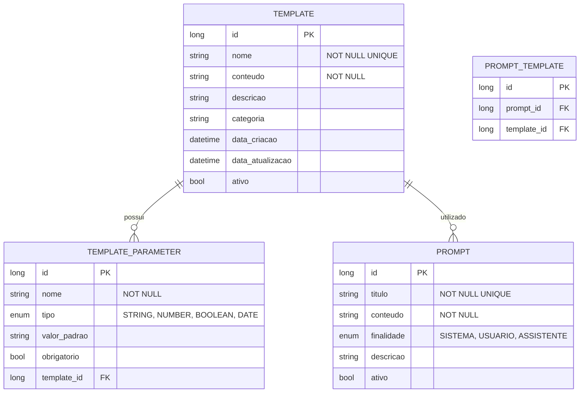

# CDU - Manter Template

## 1. Descrição do Caso de Uso

O caso de uso "Manter Template" permite o cadastro, consulta, alteração e exclusão de templates no sistema ia-core-llm. Um template representa um modelo de prompt com parâmetros variáveis que pode ser reutilizado em diferentes contextos. Templates permitem a padronização de prompts e facilitam a manutenção e reutilização de instruções para agentes LLM.

## 2. Atores

| Ator          | Descrição                                    |
|---------------|----------------------------------------------|
| Administrador | Usuário com acesso total ao sistema          |
| Desenvolvedor | Usuário responsável por criar templates       |
| Usuário       | Usuário comum que pode visualizar templates    |

## 3. Fluxo Principal

### 3.1. Fluxo: Cadastrar Template

1. O ator acessa a opção "Cadastrar Template" no menu.
2. O sistema exibe o formulário de cadastro de template.
3. O ator preenche os dados obrigatórios (nome, conteúdo).
4. O ator adiciona os parâmetros do template.
5. O ator preenche os dados opcionais (descrição, categoria).
6. O ator confirma o cadastro.
7. O sistema valida os dados:
    - Verifica se o nome já está cadastrado
    - Verifica se o conteúdo não está vazio
    - Verifica se os parâmetros estão corretamente definidos
8. O sistema salva o template no banco de dados.
9. O sistema exibe a mensagem de sucesso e os dados cadastrados.

### 3.2. Fluxo: Consultar Template

1. O ator acessa a opção "Consultar Template" no menu.
2. O sistema exibe a tela de pesquisa com filtros.
3. O ator informa os critérios de pesquisa (nome, categoria).
4. O sistema retorna a lista de templates que atendem aos critérios.
5. O ator seleciona um template da lista.
6. O sistema exibe os dados detalhados do template:
    - Nome
    - Conteúdo
    - Descrição
    - Categoria
    - Parâmetros
    - Data de cadastro

### 3.3. Fluxo: Alterar Template

1. O ator acessa a opção "Consultar Template" e seleciona um template.
2. O ator clica no botão "Editar".
3. O sistema exibe o formulário de alteração com os dados preenchidos.
4. O ator modifica os dados desejados (conteúdo, descrição, parâmetros).
5. O ator confirma a alteração.
6. O sistema valida e salva as alterações.
7. O sistema exibe a mensagem de sucesso.

### 3.4. Fluxo: Excluir Template

1. O ator acessa a opção "Consultar Template" e seleciona um template.
2. O ator clica no botão "Excluir".
3. O sistema solicita confirmação.
4. O ator confirma a exclusão.
5. O sistema verifica se há dependências (prompts ou agentes que utilizam este template).
6. Se não houver dependências, o sistema exclui o template.
7. O sistema exibe a mensagem de sucesso.
8. Se houver dependências, o sistema exibe mensagem de erro indicando as dependências.

## 4. Fluxos Alternativos

### 4.1. Template com Nome Duplicado

1. No passo 7 do fluxo principal (Cadastrar), o sistema detecta nome duplicado.
2. O sistema exibe mensagem de erro indicando que o nome já está cadastrado.
3. O fluxo retorna ao passo 3.

### 4.2. Template com Conteúdo Vazio

1. No passo 7 do fluxo principal (Cadastrar), o sistema detecta que o conteúdo está vazio.
2. O sistema exibe mensagem de erro indicando que o conteúdo é obrigatório.
3. O fluxo retorna ao passo 3.

### 4.3. Template com Dependências

1. No passo 5 do fluxo de exclusão, o sistema detecta dependências.
2. O sistema exibe lista dos prompts ou agentes que utilizam este template.
3. O ator deve remover o template dos prompts ou agentes antes de excluí-lo.

## 5. Fluxos de Navegação (Mestre-Detalhe)

### 5.1. Gerenciar Parâmetros do Template

1. A partir do formulário de template (passo 4 do fluxo principal), o ator clica em "Adicionar Parâmetro".
2. O sistema exibe diálogo de parâmetro.
3. O ator preenche nome, tipo e valor padrão do parâmetro.
4. O ator confirma.
5. O sistema adiciona o parâmetro à lista de parâmetros do template.
6. O ator pode editar ou excluir parâmetros na lista.
7. Ao salvar o template, os parâmetros também são persistidos.

### 5.2. Renderizar Template

1. A partir da tela de detalhe do template, o ator clica em "Renderizar".
2. O sistema exibe uma interface de renderização.
3. O ator insere valores para os parâmetros.
4. O sistema aplica os valores ao template e exibe o resultado renderizado.
5. O ator pode copiar o resultado renderizado.

### 5.3. Clonar Template

1. A partir da tela de detalhe do template, o ator clica em "Clonar".
2. O sistema cria uma cópia do template.
3. O ator pode modificar a cópia conforme necessário.

## 6. Regras de Negócio

| Regra | Descrição                                                         |
|-------|-------------------------------------------------------------------|
| RN001 | O nome é obrigatório e deve ser único                             |
| RN002 | O conteúdo é obrigatório e não pode estar vazio                     |
| RN003 | Parâmetros devem seguir o formato {{nome_parametro}}              |
| RN004 | Templates não podem ser excluídos se estiverem em uso              |
| RN005 | O sistema mantém histórico de versões dos templates                |
| RN006 | Parâmetros podem ter tipos: STRING, NUMBER, BOOLEAN, DATE          |
| RN007 | Templates podem ser categorizados para facilitar organização        |

## 7. Estrutura de Dados

## 8. Contratos de Interface

### 8.1. Interface REST

| Método | Endpoint                      | Descrição                      |
|--------|-------------------------------|--------------------------------|
| GET    | `/api/v1/llm/templates`      | Lista templates com paginação   |
| GET    | `/api/v1/llm/templates/{id}` | Busca template por ID          |
| POST   | `/api/v1/llm/templates`      | Cadastra novo template         |
| PUT    | `/api/v1/llm/templates/{id}` | Atualiza template             |
| DELETE | `/api/v1/llm/templates/{id}` | Exclui template               |
| GET    | `/api/v1/llm/templates/search` | Pesquisa por critérios      |
| POST   | `/api/v1/llm/templates/{id}/renderizar` | Renderiza template com parâmetros |

### 8.2. Endpoints de Relacionamento

| Método | Endpoint                              | Descrição                 |
|--------|---------------------------------------|---------------------------|
| GET    | `/api/v1/llm/templates/{id}/parametros` | Lista parâmetros do template |
| POST   | `/api/v1/llm/templates/{id}/parametros` | Adiciona parâmetro |
| PUT    | `/api/v1/llm/templates/{id}/parametros/{parametroId}` | Atualiza parâmetro |
| DELETE | `/api/v1/llm/templates/{id}/parametros/{parametroId}` | Remove parâmetro |
| GET    | `/api/v1/llm/templates/{id}/prompts` | Lista prompts que utilizam |

## 9. Casos de Extensão

| Caso de Uso        | Descrição                                      |
|--------------------|------------------------------------------------|
| Manter Prompt      | Um template pode ser utilizado em prompts        |
| Manter Agente      | Templates podem ser usados por agentes          |
| Sessão Chat        | Templates podem ser usados em sessões de chat   |
