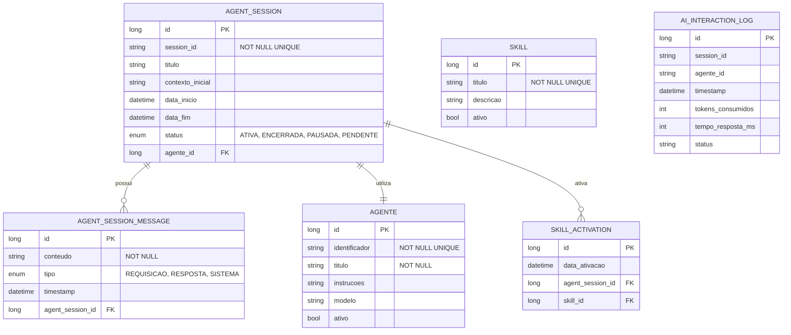

# CDU - Sessao Agente

## 1. Descrição do Caso de Uso

O caso de uso "Sessao Agente" permite o gerenciamento de sessões de orquestração multi-agente no sistema ia-core-llm. Uma sessão de agente representa uma interação complexa onde um agente principal pode orquestrar sub-agentes especializados para executar tarefas específicas. Este módulo permite iniciar, gerenciar e encerrar sessões de agentes, com suporte a ativação dinâmica de skills e ferramentas.

## 2. Atores

| Ator          | Descrição                                    |
|---------------|----------------------------------------------|
| Administrador | Usuário com acesso total ao sistema          |
| Usuário       | Usuário que interage com agentes              |
| Agente         | Agente LLM principal que orquestra sub-agentes |

## 3. Fluxo Principal

### 3.1. Fluxo: Iniciar Sessão de Agente

1. O ator acessa a opção "Nova Sessão de Agente" no menu.
2. O sistema exibe a lista de agentes principais disponíveis.
3. O ator seleciona o agente principal desejado.
4. O ator preenche dados opcionais (título da sessão, contexto inicial, skills a ativar).
5. O ator confirma o início da sessão.
6. O sistema cria uma nova sessão de agente.
7. O sistema inicializa o chat memory para a sessão.
8. O sistema carrega as configurações do agente (instruções, ferramentas, skills).
9. O sistema exibe a interface de interação com o agente.
10. O ator pode começar a enviar requisições.

### 3.2. Fluxo: Enviar Requisição ao Agente

1. O ator digita uma requisição na interface.
2. O ator clica em "Enviar" ou pressiona Enter.
3. O sistema adiciona a requisição ao chat memory.
4. O sistema envia a requisição ao agente principal.
5. O agente principal analisa a requisição.
6. O agente principal determina se precisa de sub-agentes:
    - Se sim, o agente invoca sub-agentes especializados
    - Se não, o agente processa a requisição diretamente
7. O agente principal coleta as respostas dos sub-agentes.
8. O agente principal sintetiza a resposta final.
9. O sistema adiciona a resposta ao chat memory.
10. O sistema exibe a resposta ao ator.
11. O sistema registra a interação no log de auditoria.

### 3.3. Fluxo: Ativar Skill Dinamicamente

1. Durante uma sessão, o ator solicita ativação de uma skill.
2. O sistema exibe a lista de skills disponíveis para o agente.
3. O ator seleciona a skill a ser ativada.
4. O sistema ativa a skill para a sessão atual.
5. O sistema adiciona as ferramentas da skill ao contexto do agente.
6. O sistema exibe confirmação da ativação.

### 3.4. Fluxo: Encerrar Sessão

1. O ator clica no botão "Encerrar Sessão".
2. O sistema solicita confirmação.
3. O ator confirma o encerramento.
4. O sistema persiste o chat memory da sessão.
5. O sistema marca a sessão como encerrada.
6. O sistema libera recursos alocados.
7. O sistema exibe a mensagem de sucesso.

## 4. Fluxos Alternativos

### 4.1. Agente Principal Indisponível

1. No passo 6 do fluxo principal (Iniciar Sessão), o sistema detecta que o agente está indisponível.
2. O sistema exibe mensagem de erro indicando que o agente não está ativo.
3. O fluxo retorna ao passo 2.

### 4.2. Sub-Agente Falha

1. No passo 7 do fluxo principal (Enviar Requisição), um sub-agente falha.
2. O sistema registra o erro no log de auditoria.
3. O agente principal tenta recuperar usando outro sub-agente ou processamento direto.
4. O sistema exibe mensagem de erro se a recuperação falhar.

### 4.3. Skill Não Disponível

1. No passo 4 do fluxo principal (Ativar Skill), o sistema detecta que a skill não está disponível para o agente.
2. O sistema exibe mensagem de erro indicando que a skill não pode ser ativada.
3. O fluxo retorna ao passo 2.

## 5. Fluxos de Navegação (Mestre-Detalhe)

### 5.1. Visualizar Sub-Agentes Ativos

1. A partir da interface de sessão, o ator clica em "Sub-Agentes".
2. O sistema exibe a lista de sub-agentes ativos na sessão.
3. O ator pode visualizar o status de cada sub-agente.

### 5.2. Visualizar Skills Ativas

1. A partir da interface de sessão, o ator clica em "Skills Ativas".
2. O sistema exibe a lista de skills ativas na sessão.
3. O ator pode desativar skills se necessário.

### 5.3. Visualizar Métricas da Sessão

1. A partir da interface de sessão, o ator clica em "Métricas".
2. O sistema exibe as métricas da sessão:
    - Número de requisições
    - Tempo de resposta médio
    - Tokens consumidos
    - Skills ativadas
    - Sub-agentes utilizados

## 6. Regras de Negócio

| Regra | Descrição                                                         |
|-------|-------------------------------------------------------------------|
| RN001 | Uma sessão deve estar associada a um agente principal              |
| RN002 | O agente principal pode orquestrar múltiplos sub-agentes            |
| RN003 | Skills podem ser ativadas dinamicamente durante a sessão            |
| RN004 | O sistema persiste o chat memory ao encerrar a sessão                |
| RN005 | O sistema registra todas as interações no log de auditoria          |
| RN006 | O agente principal sintetiza respostas de sub-agentes              |
| RN007 | O sistema mantém métricas de uso da sessão                          |

## 7. Estrutura de Dados

## 8. Contratos de Interface

### 8.1. Interface REST

| Método | Endpoint                              | Descrição                      |
|--------|---------------------------------------|--------------------------------|
| POST   | `/api/v1/llm/agente/sessao`         | Inicia nova sessão de agente  |
| GET    | `/api/v1/llm/agente/sessao/{id}`    | Busca sessão por ID           |
| GET    | `/api/v1/llm/agente/sessoes`        | Lista sessões do usuário       |
| PUT    | `/api/v1/llm/agente/sessao/{id}`    | Atualiza sessão              |
| DELETE | `/api/v1/llm/agente/sessao/{id}`    | Encerra sessão               |
| POST   | `/api/v1/llm/agente/sessao/{id}/requisicao` | Envia requisição |
| POST   | `/api/v1/llm/agente/sessao/{id}/confirmar` | Confirma sessão |
| GET    | `/api/v1/llm/agente/sessao/{id}/historico` | Busca histórico |

### 8.2. Endpoints de Skills

| Método | Endpoint                              | Descrição                 |
|--------|---------------------------------------|---------------------------|
| POST   | `/api/v1/llm/agente/sessao/{id}/skill/{skillId}` | Ativa skill |
| DELETE | `/api/v1/llm/agente/sessao/{id}/skill/{skillId}` | Desativa skill |
| GET    | `/api/v1/llm/agente/sessao/{id}/skills` | Lista skills ativas |

### 8.3. Endpoints de Métricas

| Método | Endpoint                              | Descrição                 |
|--------|---------------------------------------|---------------------------|
| GET    | `/api/v1/llm/agente/sessao/{id}/metricas` | Exibe métricas da sessão |

## 9. Casos de Extensão

| Caso de Uso        | Descrição                                      |
|--------------------|------------------------------------------------|
| Manter Agente      | Uma sessão utiliza um agente principal          |
| Manter Skill       | Skills podem ser ativadas dinamicamente         |
| Manter Ferramenta  | Skills são compostas por ferramentas            |
| Auditoria IA       | Interações são registradas no log de auditoria  |
| Interface Agente Conversacional | Sessões de agente são a interface principal |
