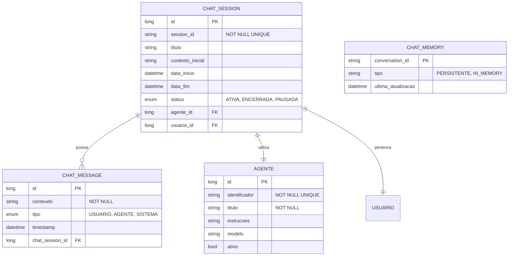

# CDU - Sessao Chat

## 1. Descrição do Caso de Uso

O caso de uso "Sessao Chat" permite o gerenciamento de sessões de chat com agentes LLM no sistema ia-core-llm. Uma sessão de chat representa uma conversação interativa entre um usuário e um agente, mantendo o contexto da conversa através de chat memory. Este módulo permite iniciar, manter e encerrar sessões de chat, com suporte a persistência de histórico e gerenciamento de contexto.

## 2. Atores

| Ator          | Descrição                                    |
|---------------|----------------------------------------------|
| Administrador | Usuário com acesso total ao sistema          |
| Usuário       | Usuário que interage com agentes via chat      |
| Agente         | Agente LLM que responde às mensagens           |

## 3. Fluxo Principal

### 3.1. Fluxo: Iniciar Sessão de Chat

1. O ator acessa a opção "Nova Conversa" no menu.
2. O sistema exibe a lista de agentes disponíveis.
3. O ator seleciona o agente desejado.
4. O ator preenche dados opcionais (título da sessão, contexto inicial).
5. O ator confirma o início da sessão.
6. O sistema cria uma nova sessão de chat.
7. O sistema inicializa o chat memory para a sessão.
8. O sistema exibe a interface de chat.
9. O ator pode começar a enviar mensagens.

### 3.2. Fluxo: Enviar Mensagem

1. O ator digita uma mensagem na interface de chat.
2. O ator clica em "Enviar" ou pressiona Enter.
3. O sistema adiciona a mensagem ao chat memory.
4. O sistema envia a mensagem ao agente LLM.
5. O agente processa a mensagem com o contexto atual.
6. O agente gera uma resposta.
7. O sistema adiciona a resposta ao chat memory.
8. O sistema exibe a resposta ao ator.
9. O sistema registra a interação no log de auditoria.

### 3.3. Fluxo: Consultar Histórico de Sessão

1. O ator acessa a opção "Histórico de Conversas" no menu.
2. O sistema exibe a lista de sessões de chat do ator.
3. O ator seleciona uma sessão da lista.
4. O sistema exibe o histórico completo da sessão:
    - Mensagens enviadas pelo usuário
    - Respostas do agente
    - Timestamp de cada mensagem
    - Contexto da sessão

### 3.4. Fluxo: Encerrar Sessão

1. O ator clica no botão "Encerrar Conversa".
2. O sistema solicita confirmação.
3. O ator confirma o encerramento.
4. O sistema persiste o chat memory da sessão.
5. O sistema marca a sessão como encerrada.
6. O sistema exibe a mensagem de sucesso.

## 4. Fluxos Alternativos

### 4.1. Agente Indisponível

1. No passo 6 do fluxo principal (Iniciar Sessão), o sistema detecta que o agente está indisponível.
2. O sistema exibe mensagem de erro indicando que o agente não está ativo.
3. O fluxo retorna ao passo 2.

### 4.2. Erro no Processamento da Mensagem

1. No passo 5 do fluxo principal (Enviar Mensagem), ocorre um erro no processamento.
2. O sistema exibe mensagem de erro ao usuário.
3. O sistema registra o erro no log de auditoria.
4. O fluxo retorna ao passo 1.

### 4.3. Limite de Contexto Excedido

1. No passo 3 do fluxo principal (Enviar Mensagem), o sistema detecta que o contexto excedeu o limite.
2. O sistema aplica estratégia de janela deslizante (sliding window).
3. O sistema mantém apenas as mensagens mais recentes.
4. O fluxo continua normalmente.

## 5. Fluxos de Navegação (Mestre-Detalhe)

### 5.1. Continuar Sessão Existente

1. A partir da lista de sessões (passo 2 do fluxo principal), o ator seleciona uma sessão encerrada.
2. O sistema exibe o histórico da sessão.
3. O ator clica em "Continuar Conversa".
4. O sistema carrega o chat memory persistido.
5. O sistema reativa a sessão.
6. O ator pode continuar enviando mensagens.

### 5.2. Exportar Histórico

1. A partir da tela de detalhe da sessão, o ator clica em "Exportar".
2. O sistema exibe opções de formato (PDF, TXT, JSON).
3. O ator seleciona o formato desejado.
4. O sistema gera o arquivo com o histórico.
5. O sistema faz o download do arquivo.

### 5.3. Compartilhar Sessão

1. A partir da tela de detalhe da sessão, o ator clica em "Compartilhar".
2. O sistema gera um link compartilhável.
3. O ator pode copiar o link.
4. O sistema define permissões de acesso ao link.

## 6. Regras de Negócio

| Regra | Descrição                                                         |
|-------|-------------------------------------------------------------------|
| RN001 | Uma sessão deve estar associada a um agente                         |
| RN002 | O chat memory mantém o contexto das últimas N mensagens            |
| RN003 | O sistema persiste o chat memory ao encerrar a sessão              |
| RN004 | O sistema registra todas as interações no log de auditoria          |
| RN005 | Sessões podem ser reativadas após encerramento                      |
| RN006 | O sistema aplica estratégia de janela deslizante quando necessário  |
| RN007 | O usuário pode ter múltiplas sessões simultâneas                   |

## 7. Estrutura de Dados

## 8. Contratos de Interface

### 8.1. Interface REST

| Método | Endpoint                      | Descrição                      |
|--------|-------------------------------|--------------------------------|
| POST   | `/api/v1/llm/chat/sessao`    | Inicia nova sessão de chat     |
| GET    | `/api/v1/llm/chat/sessao/{id}` | Busca sessão por ID          |
| GET    | `/api/v1/llm/chat/sessoes`   | Lista sessões do usuário       |
| PUT    | `/api/v1/llm/chat/sessao/{id}` | Atualiza sessão              |
| DELETE | `/api/v1/llm/chat/sessao/{id}` | Encerra sessão              |
| POST   | `/api/v1/llm/chat/sessao/{id}/mensagem` | Envia mensagem |
| GET    | `/api/v1/llm/chat/sessao/{id}/historico` | Busca histórico |

### 8.2. Endpoints de Streaming

| Método | Endpoint                              | Descrição                 |
|--------|---------------------------------------|---------------------------|
| POST   | `/api/v1/llm/chat/sessao/{id}/stream` | Streaming de resposta |

### 8.3. Endpoints de Exportação

| Método | Endpoint                              | Descrição                 |
|--------|---------------------------------------|---------------------------|
| GET    | `/api/v1/llm/chat/sessao/{id}/exportar/{formato}` | Exporta histórico |

## 9. Casos de Extensão

| Caso de Uso        | Descrição                                      |
|--------------------|------------------------------------------------|
| Manter Agente      | Uma sessão utiliza um agente                    |
| Auditoria IA       | Interações são registradas no log de auditoria  |
| Interface Agente Conversacional | Sessões de chat são a interface principal |
| Sessão Agente      | Sessões podem ser gerenciadas por agentes       |
