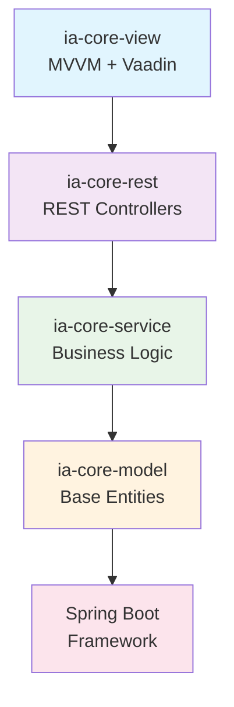

# IA Core

> **Framework modular Java para aplicações empresariais**

Sistema de inteligência artificial modular para processamento de linguagem natural, integração com modelos de linguagem (LLM) e agendamento de tarefas. Fornece componentes reutilizáveis para desenvolvimento ágil seguindo padrões consolidados.

## 🏗️ Arquitetura

O projeto segue os princípios de **Clean Architecture** com separação em camadas:



```
ia-core/
├── ia-core-model/           # Entidades e modelos de domínio
├── ia-core-service/         # Lógica de negócio base
├── ia-core-rest/           # Controllers REST genéricos
├── ia-core-view/           # Interface MVVM (Vaadin)
├── ia-core-llm-model/      # Modelos específicos de LLM
├── ia-core-llm-service/    # Serviços de LLM (Spring AI)
├── ia-core-llm-rest/       # REST para LLM
├── ia-core-llm-view/       # View de LLM
├── ia-core-quartz/         # Modelo de agendamento
├── ia-core-quartz-service/ # Serviços de agendamento
├── ia-core-quartz-view/    # View de agendamento
├── ia-core-nlp/           # Processamento de linguagem natural
├── ia-core-grammar/       # Gramáticas ANTLR
├── ia-core-report/        # Relatórios Jasper
├── ia-core-flyway/        # Migrações de banco
├── ia-core-security-*     # Módulos de segurança
└── ia-core-communication-* # Módulos de comunicação
```

## 🔧 Tecnologias

- **Java 21** (LTS) com Spring Boot 3.x
- **Jakarta EE** (Validation, Persistence)
- **Spring Data JPA** com Flyway migrations
- **Spring AI** para integração com LLMs (OpenAI, Ollama)
- **Quartz** para agendamento robusto
- **Vaadin 25.x** para interfaces web
- **Lombok** para redução de boilerplate

## 📦 Módulos Principais

| Módulo | Descrição | Status |
|--------|-----------|--------|
| **ia-core-model** | Entidades base (`BaseEntity`), TSID, filtros | ✅ Estável |
| **ia-core-service** | Serviços genéricos (`DefaultBaseService`) | ✅ Estável |
| **ia-core-rest** | Controllers REST (`DefaultBaseController`) | ✅ Estável |
| **ia-core-view** | MVVM + Vaadin Views/ViewModels | ✅ Estável |
| **ia-core-llm-service** | Integração Spring AI | ✅ Beta |
| **ia-core-quartz-service** | Agendamento de tarefas | ✅ Estável |

## 🚀 Quick Start

### Pré-requisitos

```bash
# Instalação
Java 21+: sdk install java 21-open
Maven 3.9+: sdk install maven
Docker: (opcional, para bancos e LLM)
```

### Build Rápido

```bash
# Compilar todos os módulos
mvn clean install -DskipTests

# Compilar módulo específico
mvn clean install -pl ia-core-model -DskipTests
```

### Usando como Dependência

```xml
<dependency>
    <groupId>com.ia</groupId>
    <artifactId>ia-core-service</artifactId>
    <version>1.0.0</version>
</dependency>
```

## 📖 Documentação

### ADRs (Architectural Decision Records)

- **Localização**: `ADR/` - 45+ decisões arquiteturais documentadas
- **Formato**: MADR + RFC 2119/8174 (linguagem normativa)
- **Principais**:
  - ADR-001: MapStruct para DTOs
  - ADR-003: Translator Pattern (i18n)
  - ADR-004: ServiceConfig para DI
  - ADR-014: Javadoc Standards

### CDUs (Casos de Uso)

- **Localização**: `CDU/` - Documentação de fluxos de uso
- Exemplos: Manter-Pessoa, Conversacao-Chat, GerenciamentoDTOs

### RNs (Regras de Negócio)

- **Localização**: `RN/` - Regras de validação e comportamento
- Padrão: `<CODIGO>_RN001` para identificação única

## 🏛️ Padrões Aplicados

### Arquitetura

| Padrão | ADR | Descrição |
|--------|-----|-----------|
| Service Layer | ADR-019/004 | Injeção via construtor, `@Transactional` |
| Business Rule Chain | ADR-018 | Validações compostas |
| Service Validator | ADR-019 | Validação dinâmica |
| Domain Events | ADR-005 | Comunicação desacoplada |

### Desenvolvimento

| Padrão | ADR | Descrição |
|--------|-----|-----------|
| TSID IDs | ADR-015 | Identificadores ordenáveis |
| SuperBuilder | ADR-020 | Builder com herança JPA |
| ServiceConfig | ADR-004 | Configuração de injeção |
| Specification | ADR-002 | Filtros dinâmicos |

## 🧪 Testes

```bash
# Executar todos os testes
mvn test

# Executar com cobertura
mvn verify jacoco:report

# Ver relatório
open target/site/jacoco/index.html
```

**Cobertura mínima**: 75% (ver ADR-012)

## 📝 Convenções

### Conventional Commits

```
feat: Nova funcionalidade
fix: Correção de bug
docs: Documentação
refactor: Refatoração
test: Testes
chore: Manutenção
```

### Versionamento

- **SemVer 2.0**: MAJOR.MINOR.PATCH
- Ver `ADR-037` para detalhes

## 🤝 Contribuição

1. Fork o projeto
2. Crie branch: `feature/nova-funcionalidade`
3. Commit: `feat: descrição clara`
4. Push: `git push origin feature/nova-funcionalidade`
5. Pull Request com descrição completa

## 📄 Licença

Projeto interno - Uso restrito à equipe de desenvolvimento.

## 📞 Suporte

Abrir issue ou contatar: `team-core@empresa.com`
