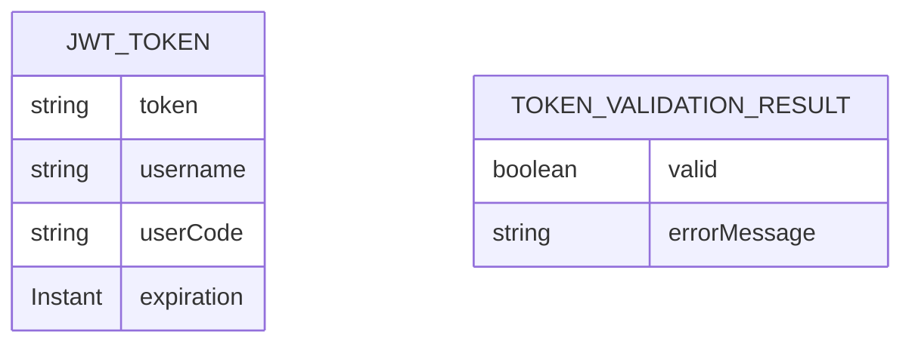

# CDU002: Autenticação JWT

## Metadados
- **Nome do CDU**: CDU002-AutenticacaoJWT
- **Versão**: 1.0
- **Data**: 2025-06-17
- **Autor**: IA Core
- **Status**: Em Revisão

## Descrição do Caso de Uso

### Descrição Breve
Este caso de uso descreve como o sistema autentica requisições REST usando tokens JWT, incluindo geração, validação e extração de informações do token.

### Objetivos
- Autenticar usuários através de tokens JWT
- Validar tokens JWT em cada requisição protegida
- Extrair informações do usuário do token (username, userCode)
- Proteger endpoints que requerem autenticação

### Escopo
- **Incluído**: Geração de tokens JWT, validação de tokens, extração de informações do token
- **Excluído**: Implementação interna do algoritmo de criptografia JWT

## Atores

| Ator | Descrição | Tipo |
|------|------------|------|
| Cliente REST | Aplicação cliente que envia requisições com token JWT | Primário |
| Sistema | Aplicação Spring Boot que processa requisições REST | Secundário |

## Pré-condições
- **Precondição 1**: O módulo ia-core-rest deve estar configurado no classpath
- **Precondição 2**: O CoreRestSecurityConfig deve estar configurado
- **Precondição 3**: O TokenService deve estar configurado com chave secreta

## Pós-condições
- **Pós-condição de Sucesso**: O usuário é autenticado e a requisição é processada
- **Pós-condição de Falha**: A requisição é rejeitada com status 401

## Fluxo Principal (Basic Flow)

**Trigger**: O cliente envia uma requisição com token JWT no header Authorization

**Passos**:
1. **Dado** uma requisição REST com header Authorization
2. **Quando** o CoreJwtAuthenticationFilter intercepta a requisição
3. **Então** o sistema extrai o token do header [RN001]
4. **E** o sistema valida o formato do token
5. **Quando** o token está no formato correto
6. **Então** o sistema chama TokenService.validateToken()
7. **Quando** o token é válido
8. **Então** o sistema extrai username do token
9. **E** o sistema extrai userCode do token
10. **E** o sistema carrega os detalhes do usuário
11. **E** o sistema define a autenticação no SecurityContext
12. **E** a requisição é processada

## Fluxos Alternativos

**Fluxo Alternativo 1**: Token ausente
1. **Dado** uma requisição REST sem header Authorization
2. **Quando** o CoreJwtAuthenticationFilter intercepta a requisição
3. **Então** o sistema lança AuthenticationException
4. **E** o CoreJwtAuthenticationEntryPoint retorna status 401

**Fluxo Alternativo 2**: Token inválido
1. **Dado** uma requisição REST com token inválido
2. **Quando** o TokenService.validateToken() retorna inválido
3. **Então** o sistema lança AuthenticationException
4. **E** o CoreJwtAuthenticationEntryPoint retorna status 401

## Fluxos de Exceção

**Fluxo de Exceção 1**: Token expirado
1. **Dado** um token JWT expirado
2. **Quando** o TokenService.validateToken() detecta expiração
3. **Então** o sistema lança AuthenticationException
4. **E**: O CoreJwtAuthenticationEntryPoint retorna status 401

## Regras de Negócio

| ID | Regra de Negócio | Tipo | Aplicação |
|----|------------------|------|-----------|
| RN001 | O token deve estar no formato "Bearer {token}" | Validação | Extração de token |
| RN002 | Tokens expirados devem ser rejeitados | Validação | Validação de token |
| RN003 | Tokens assinados com chave incorreta devem ser rejeitados | Validação | Validação de token |

## Estrutura de Dados

## Contratos de Interface

**Interface TokenService**:
| Método | Parâmetros | Retorno | Descrição |
|--------|------------|---------|------------|
| generateToken | username, userCode | JwtToken | Gera token JWT |
| validateToken | token | TokenValidationResult | Valida token JWT |
| getUsernameFromToken | token | String | Extrai username do token |
| getUserCodeFromToken | token | String | Extrai userCode do token |

## Requisitos Especiais
- **Segurança**: Tokens devem ser assinados com chave secreta forte
- **Performance**: Validação de token deve ser rápida (< 5ms)
- **Conformidade**: Deve seguir RFC 7519 para JWT

## Pontos de Extensão
- **Extensão 1**: Adicionar claims customizados ao token
- **Extensão 2**: Suporte para refresh tokens

## Referências
- ADR-028: Use JWT for Stateless Authentication
- ADR-053: Usar CDU para Documentação de Casos de Uso
- RFC 7519: JSON Web Token (JWT)
