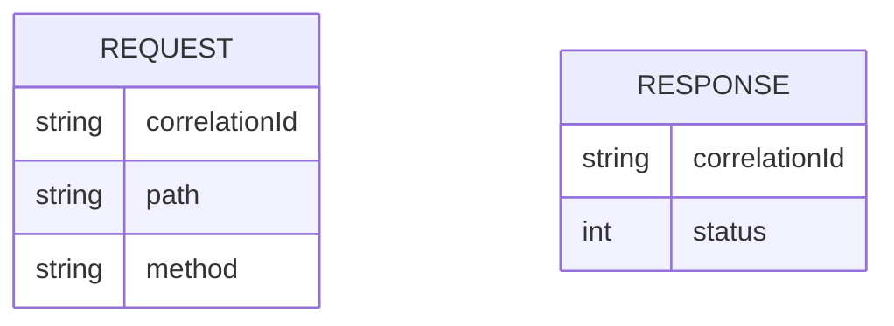

# CDU003: Correlation ID Filter

## Metadados
- **Nome do CDU**: CDU003-CorrelationIdFilter
- **Versão**: 1.0
- **Data**: 2025-06-17
- **Autor**: IA Core
- **Status**: Em Revisão

## Descrição do Caso de Uso

### Descrição Breve
Este caso de uso descreve como o sistema gerencia Correlation IDs para rastreamento de requisições REST através de múltiplos serviços, permitindo correlação de logs e debugging distribuído.

### Objetivos
- Gerar Correlation ID para cada requisição
- Propagar Correlation ID entre serviços
- Permitir rastreamento de requisições através de logs
- Facilitar debugging distribuído

### Escopo
- **Incluído**: Geração de Correlation ID, extração de header X-Correlation-Id, propagação para resposta
- **Excluído**: Integração com sistemas externos de tracing

## Atores

| Ator | Descrição | Tipo |
|------|------------|------|
| Cliente REST | Aplicação cliente que envia requisições | Primário |
| Sistema | Aplicação Spring Boot que processa requisições REST | Secundário |

## Pré-condições
- **Precondição 1**: O módulo ia-core-rest deve estar configurado no classpath
- **Precondição 2**: O CorrelationIdFilter deve estar configurado como filtro

## Pós-condições
- **Pós-condição de Sucesso**: Cada requisição tem um Correlation ID único associado
- **Pós-condição de Falha**: O sistema gera um novo Correlation ID se o cliente não fornecer

## Fluxo Principal (Basic Flow)

**Trigger**: O cliente envia uma requisição REST

**Passos**:
1. **Dado** uma requisição REST
2. **Quando** o CorrelationIdFilter intercepta a requisição
3. **Então** o sistema verifica se existe header X-Correlation-Id
4. **Quando** o header existe [RN001]
5. **Então** o sistema usa o Correlation ID do header
6. **Quando** o header não existe
7. **Então** o sistema gera um novo Correlation ID [RN002]
8. **E** o sistema armazena o Correlation ID no MDC
9. **E** o sistema inclui o Correlation ID nos logs
10. **Quando** a resposta é gerada
11. **Então** o sistema inclui o Correlation ID no header X-Correlation-Id da resposta

## Fluxos Alternativos

**Fluxo Alternativo 1**: Cliente fornece Correlation ID inválido
1. **Dado** uma requisição com X-Correlation-Id inválido
2. **Quando** o CorrelationIdFilter intercepta a requisição
3. **Então** o sistema ignora o valor inválido
4. **E** o sistema gera um novo Correlation ID

## Fluxos de Exceção

**Fluxo de Exceção 1**: Falha ao gerar Correlation ID
1. **Dado** falha no gerador de UUID
2. **Quando** o sistema tenta gerar Correlation ID
3. **Então** o sistema usa timestamp como fallback

## Regras de Negócio

| ID | Regra de Negócio | Tipo | Aplicação |
|----|------------------|------|-----------|
| RN001 | Se o cliente fornecer Correlation ID, deve ser usado | Validação | Propagação de ID |
| RN002 | Se o cliente não fornecer Correlation ID, deve ser gerado um novo | Validação | Geração de ID |
| RN003 | O Correlation ID deve ser único por requisição | Validação | Geração de ID |

## Estrutura de Dados

## Contratos de Interface

**Interface HTTP**:
| Header | Descrição | Obrigatório |
|--------|------------|-------------|
| X-Correlation-Id | ID de correlação da requisição | Não |

## Requisitos Especiais
- **Performance**: Geração de Correlation ID deve ser rápida (< 1ms)
- **Segurança**: Correlation ID não deve conter informações sensíveis
- **Usabilidade**: Formato deve ser legível e padronizado

## Pontos de Extensão
- **Extensão 1**: Integração com sistemas de tracing distribuído (Zipkin, Jaeger)
- **Extensão 2**: Adicionar metadados customizados ao Correlation ID

## Referências
- ADR-013: Logging and Monitoring Patterns
- ADR-053: Usar CDU para Documentação de Casos de Uso
- W3C Trace Context: https://www.w3.org/TR/trace-context/
