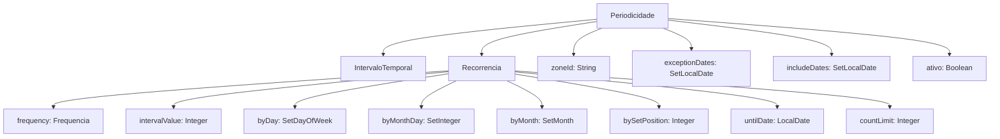
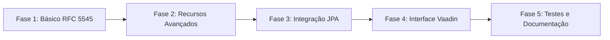

# Plano de Modificações - Alinhamento com RFC 5545

> **Status da Implementação: CONCLUÍDO**
> 
> Todas as fases foram concluídas.
> Veja a seção 7.2 para detalhes do progresso.

## 1. Análise da Estrutura Atual

### Arquivos Modificados/Criados

| Arquivo | Ação | Descrição |
|---------|------|-----------|
| [`Frequencia.java`](ia-core/ia-core-quartz/src/main/java/com/ia/core/quartz/model/periodicidade/Frequencia.java) | Modificado | Adicionados nomes RFC 5545 (DAILY, WEEKLY, MONTHLY, YEARLY) |
| [`Recorrencia.java`](ia-core/ia-core-quartz/src/main/java/com/ia/core/quartz/model/periodicidade/Recorrencia.java) | Modificado | Adicionados campos WKST, BYYEARDAY, BYWEEKNO, BYHOUR, BYMINUTE, BYSECOND |
| [`ExclusaoRecorrencia.java`](ia-core/ia-core-quartz/src/main/java/com/ia/core/quartz/model/periodicidade/ExclusaoRecorrencia.java) | Criado | Nova classe para suporte a EXRULE |
| [`Periodicidade.java`](ia-core/ia-core-quartz/src/main/java/com/ia/core/quartz/model/periodicidade/Periodicidade.java) | Modificado | Adicionado campo exclusaoRecorrencia |
| [`RecorrenciaDTO.java`](ia-core/ia-core-quartz-service-model/src/main/java/com/ia/core/quartz/service/periodicidade/dto/RecorrenciaDTO.java) | Modificado | Novos campos DTO |
| [`ExclusaoRecorrenciaDTO.java`](ia-core/ia-core-quartz-service-model/src/main/java/com/ia/core/quartz/service/periodicidade/dto/ExclusaoRecorrenciaDTO.java) | Criado | Novo DTO para EXRULE |
| [`PeriodicidadeDTO.java`](ia-core/ia-core-quartz-service-model/src/main/java/com/ia/core/quartz/service/periodicidade/dto/PeriodicidadeDTO.java) | Modificado | Adicionado campo exclusaoRecorrencia |
| [`OccurrenceCalculator.java`](ia-core/ia-core-quartz-service-model/src/main/java/com/ia/core/quartz/service/periodicidade/dto/OccurrenceCalculator.java) | Modificado | Suporte a novos valores do enum Frequencia |
| [`PeriodicidadeFormatter.java`](ia-core/ia-core-quartz-service-model/src/main/java/com/ia/core/quartz/service/periodicidade/dto/PeriodicidadeFormatter.java) | Modificado | Suporte a novos valores do enum Frequencia |
| [`ICalendarSerializer.java`](ia-core/ia-core-quartz-service-model/src/main/java/com/ia/core/quartz/service/periodicidade/dto/ICalendarSerializer.java) | Criado | Serialização RRULE/EXRULE para formato iCalendar, métodos toICS e exportToICSFile |
| [`RRuleValidator.java`](ia-core/ia-core-quartz-service-model/src/main/java/com/ia/core/quartz/service/periodicidade/dto/RRuleValidator.java) | Criado | Validação de formato RRULE/EXRULE RFC 5545 |
| [`V1_0_055__add_rfc5545_recurrence_fields.sql`](ia-core/ia-core-flyway/src/main/resources/db/migrations/V1_0_055__add_rfc5545_recurrence_fields.sql) | Criado | Migração Flyway para novos campos |
| [`PeriodicidadeRepository.java`](ia-core/ia-core-quartz/src/main/java/com/ia/core/quartz/model/periodicidade/repository/PeriodicidadeRepository.java) | Criado | Repositório JPA para Periodicidade |
| [`IntervaloTemporal.java`](ia-core/ia-core-quartz/src/main/java/com/ia/core/quartz/model/periodicidade/IntervaloTemporal.java) | Modificado | Separação de data e hora (startDate, startTime, endDate, endTime) |
| [`IntervaloTemporalDTO.java`](ia-core/ia-core-quartz-service-model/src/main/java/com/ia/core/quartz/service/periodicidade/dto/IntervaloTemporalDTO.java) | Modificado | Separação de data e hora (startDate, startTime, endDate, endTime) |
| [`IntervaloTemporalFormView.java`](ia-core/ia-core-quartz-view/src/main/java/com/ia/core/quartz/view/periodicidade/form/IntervaloTemporalFormView.java) | Modificado | Campos separados para data e hora |
| [`PeriodicidadeTranslator.java`](ia-core/ia-core-quartz-service-model/src/main/java/com/ia/core/quartz/service/periodicidade/dto/PeriodicidadeTranslator.java) | Modificado | Adicionadas constantes START_DATE, END_DATE |
| [`FormView.java`](ia-core/ia-core-view/src/main/java/com/ia/core/view/components/form/FormView.java) | Modificado | Implementa HasDateTimeCreator para campos de data/hora |

### 1.1 Classes Principais Identificadas

A tabela abaixo apresenta as classes relacionadas à Periodicidade encontradas no projeto:

| Classe | Caminho | Descrição |
|--------|---------|-----------|
| [`Periodicidade`](ia-core/ia-core-quartz/src/main/java/com/ia/core/quartz/model/periodicidade/Periodicidade.java) | ia-core-quartz | Entidade JPA principal |
| [`PeriodicidadeDTO`](ia-core/ia-core-quartz-service-model/src/main/java/com/ia/core/quartz/service/periodicidade/dto/PeriodicidadeDTO.java) | ia-core-quartz-service-model | DTO para transferência de dados |
| [`IntervaloTemporal`](ia-core/ia-core-quartz/src/main/java/com/ia/core/quartz/model/periodicidade/IntervaloTemporal.java) | ia-core-quartz | Embeddable para período |
| [`IntervaloTemporalDTO`](ia-core/ia-core-quartz-service-model/src/main/java/com/ia/core/quartz/service/periodicidade/dto/IntervaloTemporalDTO.java) | ia-core-quartz-service-model | DTO do período |
| [`Recorrencia`](ia-core/ia-core-quartz/src/main/java/com/ia/core/quartz/model/periodicidade/Recorrencia.java) | ia-core-quartz | Value Object com regra de recorrência |
| [`RecorrenciaDTO`](ia-core/ia-core-quartz-service-model/src/main/java/com/ia/core/quartz/service/periodicidade/dto/RecorrenciaDTO.java) | ia-core-quartz-service-model | DTO da regra de recorrência |
| [`Frequencia`](ia-core/ia-core-quartz/src/main/java/com/ia/core/quartz/model/periodicidade/Frequencia.java) | ia-core-quartz | Enum de frequências |
| [`PeriodicidadeTrigger`](ia-core/ia-core-quartz-service/src/main/java/com/ia/core/quartz/service/PeriodicidadeTrigger.java) | ia-core-quartz-service | Trigger personalizado para Quartz |
| [`OccurrenceCalculator`](ia-core/ia-core-quartz-service-model/src/main/java/com/ia/core/quartz/service/periodicidade/dto/OccurrenceCalculator.java) | ia-core-quartz-service-model | Calculadora de ocorrências |
| [`PeriodicidadeFormatter`](ia-core/ia-core-quartz-service-model/src/main/java/com/ia/core/quartz/service/periodicidade/dto/PeriodicidadeFormatter.java) | ia-core-quartz-service-model | Formatador para UI |

### 1.2 Estrutura Atual do Modelo



---

## 2. Requisitos da RFC 5545

### 2.1 Visão Geral

A RFC 5545 (iCalendar) define o padrão para representação de eventos recorrentes. Os principais componentes são:

| Componente | Sigla | Descrição |
|------------|-------|-----------|
| Recurrence Rule | RRULE | Define a regra de recorrência principal |
| Exception Rule | EXRULE | Define regras de exclusão |
| Recurrence Date | RDATE | Datas adicionais de ocorrência |
| Exception Date | EXDATE | Datas a serem excluídas |

### 2.2 Parâmetros RFC 5545 Suportados Parcialmente

| Parâmetro | Status Atual | Descrição |
|-----------|-------------|-----------|
| FREQ | ✅ Suportado | Frequência base (diária, semanal, mensal, anual) |
| INTERVAL | ✅ Suportado | Intervalo multiplicador |
| UNTIL | ✅ Suportado | Data limite da recurrência |
| COUNT | ✅ Suportado | Número máximo de ocorrências |
| BYMONTH | ✅ Suportado | Filtro por mês |
| BYMONTHDAY | ✅ Suportado | Filtro por dia do mês |
| BYDAY | ✅ Suportado | Filtro por dia da semana |
| BYSETPOS | ✅ Suportado | Posição no conjunto (positivos e negativos) |
| WKST | ✅ Suportado | Dia de início da semana |
| BYYEARDAY | ✅ Suportado | Dia do ano |
| BYWEEKNO | ✅ Suportado | Número da semana |
| BYHOUR | ✅ Suportado | Hora |
| BYMINUTE | ✅ Suportado | Minuto |
| BYSECOND | ✅ Suportado | Segundo |
| EXRULE | ✅ Suportado | Regra de exclusão |

### 2.3 Parâmetros RFC 5545 Não Suportados

*Nenhum parâmetro pendente - todos implementados!*

---

## 3. Lacunas entre Implementação Atual e RFC 5545

### 3.1 Enum Frequencia

**Atual:**
```java
public enum Frequencia {
  DIARIAMENTE(1), SEMANALMENTE(2), MENSALMENTE(3), ANUALMENTE(4);
}
```

**Problema:** Usa nomes em português, não segue convenção RFC 5545 (DAILY, WEEKLY, MONTHLY, YEARLY).

### 3.2 Suporte a BYSETPOS Negativo

**Atual:** Apenas valores positivos são suportados.

**RFC 5545:** Valores negativos indicam posição a partir do final (-1 = última, -2 = penúltima).

**Solução:** Alterar tipo de `Integer` para permitir valores negativos.

### 3.3 Falta de Suporte a EXRULE

**RFC 5545:** Permite especificar regras de exclusão separadas da regra principal.

**Solução:** Criar classe `ExclusaoRecorrencia` similar a `Recorrencia`.

### 3.4 Falta de Suporte a WKST

**RFC 5545:** Define o dia de início da semana para frequências semanais e anuais.

**Solução:** Adicionar campo `weekStartDay` (WKST) ao modelo.

### 3.5 Serialização iCalendar

**RFC 5545:** Define formato texto para RRULE: `FREQ=DAILY;INTERVAL=2;BYDAY=MO,WE`

**Solução:** Implementar métodos de serialização e deserialização.

---

## 4. Propostas de Modificações

### 4.1 Modificações no Enum Frequencia

```java
/**
 * Enum representando as frequências de recorrência conforme RFC 5545.
 * Mantém compatibilidade com nomes anteriores para não quebrar código existente.
 */
public enum Frequencia {
    // Nomes em português (para compatibilidade)
    DIARIAMENTE("DAILY", 1),
    SEMANALMENTE("WEEKLY", 2),
    MENSALMENTE("MONTHLY", 3),
    ANUALMENTE("YEARLY", 4),
    
    // Nomes RFC 5545 (recomendados para novos desenvolvimentos)
    DAILY("DAILY", 1),
    WEEKLY("WEEKLY", 2),
    MONTHLY("MONTHLY", 3),
    YEARLY("YEARLY", 4);

    private final String rfcName;
    private final int codigo;

    Frequencia(String rfcName, int codigo) {
        this.rfcName = rfcName;
        this.codigo = codigo;
    }

    /**
     * @return Nome RFC 5545 da frequência
     */
    public String getRfcName() {
        return rfcName;
    }

    /**
     * Converte nome RFC 5545 para enum.
     * @param rfcName Nome RFC (ex: "DAILY", "WEEKLY")
     * @return Enum correspondente
     */
    public static Frequencia fromRfcName(String rfcName) {
        for (Frequencia f : values()) {
            if (f.rfcName.equalsIgnoreCase(rfcName)) {
                return f;
            }
        }
        return null;
    }
}
```

### 4.2 Melhorias na Classe Recorrencia

```java
@Embeddable
@Getter
@Setter
@NoArgsConstructor
@AllArgsConstructor
public class Recorrencia implements Serializable {
    // ... campos existentes ...

    /**
     * Dia de início da semana.
     * Equivalente ao parâmetro WKST da RFC 5545.
     * Padrão: SEGUNDA (segunda-feira)
     */
    @Column(name = "week_start_day")
    private DayOfWeek weekStartDay = DayOfWeek.MONDAY;

    /**
     * Dias do ano.
     * Equivalente ao parâmetro BYYEARDAY da RFC 5545.
     * Valores de 1 a 366 ou negativos (-1 a -366)
     */
    @ElementCollection(fetch = FetchType.LAZY)
    @CollectionTable(name = "RECORRENCIA_DIA_ANO", schema = SCHEMA_NAME)
    @Column(name = "by_year_day")
    private Set<Integer> byYearDay = new HashSet<>();

    /**
     * Semanas do ano.
     * Equivalente ao parâmetro BYWEEKNO da RFC 5545.
     */
    @ElementCollection(fetch = FetchType.LAZY)
    @CollectionTable(name = "RECORRENCIA_SEMANA_ANO", schema = SCHEMA_NAME)
    @Column(name = "by_week_no")
    private Set<Integer> byWeekNo = new HashSet<>();

    /**
     * Horas do dia.
     * Equivalente ao parâmetro BYHOUR da RFC 5545.
     */
    @ElementCollection(fetch = FetchType.LAZY)
    @CollectionTable(name = "RECORRENCIA_HORA", schema = SCHEMA_NAME)
    @Column(name = "by_hour")
    private Set<Integer> byHour = new HashSet<>();

    /**
     * Minutos da hora.
     * Equivalente ao parâmetro BYMINUTE da RFC 5545.
     */
    @ElementCollection(fetch = FetchType.LAZY)
    @CollectionTable(name = "RECORRENCIA_MINUTO", schema = SCHEMA_NAME)
    @Column(name = "by_minute")
    private Set<Integer> byMinute = new HashSet<>();

    /**
     * Segundos do minuto.
     * Equivalente ao parâmetro BYSECOND da RFC 5545.
     */
    @ElementCollection(fetch = FetchType.LAZY)
    @CollectionTable(name = "RECORRENCIA_SEGUNDO", schema = SCHEMA_NAME)
    @Column(name = "by_second")
    private Set<Integer> bySecond = new HashSet<>();
}
```

### 4.3 Adição de Suporte a EXRULE

```java
/**
 * Value Object para regra de exclusão.
 * Equivalente ao parâmetro EXRULE da RFC 5545.
 */
@Embeddable
@Getter
@Setter
@NoArgsConstructor
@AllArgsConstructor
public class ExclusaoRecorrencia implements Serializable {
    // Mesmos campos de Recorrencia
    private Frequencia frequency;
    private Integer intervalValue;
    private Set<DayOfWeek> byDay = new HashSet<>();
    private Set<Integer> byMonthDay = new HashSet<>();
    private Set<Month> byMonth = new HashSet<>();
    private Integer bySetPosition;
    private LocalDate untilDate;
    private Integer countLimit;
    private DayOfWeek weekStartDay;
}
```

### 4.4 Periodicidade com Suporte a EXRULE (IMPLEMENTADO)

*Nota: Os campos rruleText e exruleText foram REMOVIDOS da implementação final*

```java
@Entity
@Table(name = Periodicidade.TABLE_NAME, schema = Periodicidade.SCHEMA_NAME)
@Getter
@Setter
@SuperBuilder
@EqualsAndHashCode(callSuper = true)
@NoArgsConstructor
@AllArgsConstructor
public class Periodicidade extends BaseEntity {
    
    // ... campos existentes ...
    
    /**
     * Regra de exclusão.
     * Equivalente ao parâmetro EXRULE da RFC 5545.
     */
    @Embedded
    private ExclusaoRecorrencia exclusaoRecorrencia;
}
```

> **Nota**: Os campos `rruleText` e `exruleText` foram removidos da implementação.
> A serialização para formato iCalendar é feita dinamicamente via `ICalendarSerializer`.

### 4.5 Serialização iCalendar

```java
/**
 * Utilitário para serialização e deserialização de regras iCalendar.
 */
public final class ICalendarSerializer {

    private ICalendarSerializer() {}

    /**
     * Serializa Periodicidade para formato RRULE RFC 5545.
     * @param periodicidade A periodicidade
     * @return String no formato RRULE (ex: FREQ=WEEKLY;INTERVAL=2;BYDAY=MO,WE)
     */
    public static String toRRule(Periodicidade periodicidade) {
        if (periodicidade == null || periodicidade.getRegra() == null) {
            return null;
        }

        Recorrencia r = periodicidade.getRegra();
        StringBuilder sb = new StringBuilder();
        
        // FREQ (obrigatório)
        sb.append("FREQ=").append(r.getFrequency().getRfcName());
        
        // INTERVAL
        if (r.getIntervalValue() != null && r.getIntervalValue() > 1) {
            sb.append(";INTERVAL=").append(r.getIntervalValue());
        }
        
        // UNTIL
        if (r.getUntilDate() != null) {
            sb.append(";UNTIL=").append(formatDateTime(r.getUntilDate()));
        }
        
        // COUNT
        if (r.getCountLimit() != null) {
            sb.append(";COUNT=").append(r.getCountLimit());
        }
        
        // BYMONTH
        if (!r.getByMonth().isEmpty()) {
            sb.append(";BYMONTH=").append(
                r.getByMonth().stream()
                    .map(Month::getValue)
                    .sorted()
                    .map(String::valueOf)
                    .collect(Collectors.joining(","))
            );
        }
        
        // BYMONTHDAY
        if (!r.getByMonthDay().isEmpty()) {
            sb.append(";BYMONTHDAY=").append(
                r.getByMonthDay().stream()
                    .sorted()
                    .map(String::valueOf)
                    .collect(Collectors.joining(","))
            );
        }
        
        // BYDAY
        if (!r.getByDay().isEmpty()) {
            sb.append(";BYDAY=").append(
                r.getByDay().stream()
                    .sorted()
                    .map(ICalendarSerializer::toRfcDayOfWeek)
                    .collect(Collectors.joining(","))
            );
        }
        
        // BYSETPOS
        if (r.getBySetPosition() != null) {
            sb.append(";BYSETPOS=").append(r.getBySetPosition());
        }
        
        // WKST
        if (r.getWeekStartDay() != null && r.getWeekStartDay() != DayOfWeek.MONDAY) {
            sb.append(";WKST=").append(toRfcDayOfWeek(r.getWeekStartDay()));
        }
        
        return sb.toString();
    }

    /**
     * Deserializa string RRULE para Periodicidade.
     * @param rruleText String no formato RRULE
     * @return PeriodicidadeBuilder para construção
     */
    public static PeriodicidadeBuilder fromRRule(String rruleText) {
        // Implementação do parser
    }
    
    private static String formatDateTime(LocalDate date) {
        return date.format(DateTimeFormatter.ofPattern("yyyyMMdd"));
    }
    
    private static String toRfcDayOfWeek(DayOfWeek day) {
        return switch (day) {
            case MONDAY -> "MO";
            case TUESDAY -> "TU";
            case WEDNESDAY -> "WE";
            case THURSDAY -> "TH";
            case FRIDAY -> "FR";
            case SATURDAY -> "SA";
            case SUNDAY -> "SU";
        };
    }
}
```

---

## 5. Modificações na Integração JPA

### 5.1 Novas Tabelas Necessárias

| Tabela | Descrição | Colunas |
|--------|-----------|---------|
| `QUARTZ.QRTZ_PERIODICIDADE_EXCLUSAO_REGRA` | Armazena EXRULE | Similar a `RECORRENCIA` |
| `QUARTZ.QRTZ_PERIODICIDADE_DIA_ANO` | BYYEARDAY | periodicidade_id, by_year_day |
| `QUARTZ.QRTZ_PERIODICIDADE_SEMANA_ANO` | BYWEEKNO | periodicidade_id, by_week_no |
| `QUARTZ.QRTZ_PERIODICIDADE_HORA` | BYHOUR | periodicidade_id, by_hour |
| `QUARTZ.QRTZ_PERIODICIDADE_MINUTO` | BYMINUTE | periodicidade_id, by_minuto |
| `QUARTZ.QRTZ_PERIODICIDADE_SEGUNDO` | BYSECOND | periodicidade_id, by_second |

### 5.2 Migração Flyway Sugerida

```sql
-- Adicionar colunas à tabela de recorrência
ALTER TABLE QUARTZ.QRTZ_PERIODICIDADE_REGRA 
ADD COLUMN week_start_day VARCHAR(20);

-- Nova tabela para EXRULE
CREATE TABLE QUARTZ.QRTZ_PERIODICIDADE_EXCLUSAO_REGRA (
    periodicidade_id BIGINT NOT NULL,
    frequency VARCHAR(20) NOT NULL,
    interval_value INTEGER,
    by_set_position INTEGER,
    until_date DATE,
    count_limit INTEGER,
    week_start_day VARCHAR(20),
    PRIMARY KEY (periodicidade_id)
);

-- Tabelas de elementos
CREATE TABLE QUARTZ.QRTZ_PERIODICIDADE_DIA_ANO (
    periodicidade_id BIGINT NOT NULL,
    by_year_day INTEGER NOT NULL,
    PRIMARY KEY (periodicidade_id, by_year_day)
);

CREATE TABLE QUARTZ.QRTZ_PERIODICIDADE_SEMANA_ANO (
    periodicidade_id BIGINT NOT NULL,
    by_week_no INTEGER NOT NULL,
    PRIMARY KEY (periodicidade_id, by_week_no)
);

-- Armazenar RRULE/EXRULE texto para interoperabilidade
ALTER TABLE QUARTZ.QRTZ_PERIODICIDADE 
ADD COLUMN rrule_text VARCHAR(1000);

ALTER TABLE QUARTZ.QRTZ_PERIODICIDADE 
ADD COLUMN exrule_text VARCHAR(1000);
```

---

## 6. Modificações na Interface Vaadin 24

### 6.1 Componentes Vaadin Necessários

| Componente | Descrição | Status |
|------------|-----------|--------|
| WeekStartPicker | Selector para WKST | A criar |
| YearDayPicker | Selector para BYYEARDAY | A criar |
| WeekNoPicker | Selector para BYWEEKNO | A criar |
| TimePartPicker | Selector para BYHOUR, BYMINUTE, BYSECOND | A criar |
| RRuleTextField | Editor de texto RRULE | A criar |
| RecurrencePreview | Visualização de ocorrências | A criar |

### 6.2 Exemplo: RecorrenciaFormView Atualizado

```java
/**
 * FormView para Recorrencia atualizado com novos campos RFC 5545.
 */
public class RecorrenciaFormView extends FormView<RecorrenciaDTO> {
    
    // Campos existentes...
    private ComboBox<Frequencia> frequencyField;
    private IntegerField intervalField;
    private MultiSelectComboBox<DayOfWeek> byDayField;
    private MultiSelectComboBox<Integer> byMonthDayField;
    private MultiSelectComboBox<Month> byMonthField;
    private IntegerField bySetPositionField;
    private DatePicker untilDateField;
    private IntegerField countLimitField;
    
    // Novos campos
    private ComboBox<DayOfWeek> weekStartDayField;
    private MultiSelectComboBox<Integer> byYearDayField;
    private MultiSelectComboBox<Integer> byWeekNoField;
    private MultiSelectComboBox<Integer> byHourField;
    private TextField rruleTextField;
    
    // Visualização
    private DateGrid<LocalDateTime> previewGrid;
    
    @Override
    protected void createFormFields() {
        // Campos existentes...
        
        // Novo campo WKST
        weekStartDayField = new ComboBox<>("Dia de Início da Semana");
        weekStartDayField.setItems(DayOfWeek.values());
        weekStartDayField.setValue(DayOfWeek.MONDAY);
        
        // Campos RFC 5545 avançados
        byYearDayField = new MultiSelectComboBox<>("Dias do Ano (BYYEARDAY)");
        byYearDayField.setItems(1, 2, 3, 4, 5, 6, 7, 8, 9, 10, /* ... */ 366);
        
        byWeekNoField = new MultiSelectComboBox<>("Semanas do Ano (BYWEEKNO)");
        byWeekNoField.setItems(1, 2, 3, 4, 5, /* ... */ 53);
        
        byHourField = new MultiSelectComboBox<>("Horas (BYHOUR)");
        byHourField.setItems(0, 1, 2, 3, 4, 5, 6, 7, 8, 9, 10, 11, 12, 13, 14, 15, 16, 17, 18, 19, 20, 21, 22, 23);
        
        // Editor de texto RRULE
        rruleTextField = new TextField("Regra iCalendar (RFC 5545)");
        rruleTextField.setWidthFull();
        
        // Pré-visualização de ocorrências
        previewGrid = new DateGrid<>("Próximas Ocorrências");
        previewGrid.setColumns("date", "time");
    }
    
    /**
     * Gera preview de ocorrências baseado na regra.
     */
    private void generatePreview() {
        if (formObject.getRegra() != null) {
            var calculator = new OccurrenceCalculator();
            var preview = calculator.generateOccurrences(
                formObject, 
                LocalDateTime.now(), 
                10
            );
            previewGrid.setItems(preview);
        }
    }
}
```

---

## 7. Plano de Implementação

### 7.1 Fases de Implementação



### 7.2 Detalhamento das Fases

#### Fase 1: Básico RFC 5545
- [x] Atualizar enum `Frequencia` com nomes RFC
- [x] Adicionar suporte a `WKST` em `Recorrencia`
- [x] Implementar serialização `toRRule()` básica
- [x] Atualizar `OccurrenceCalculator` para suportar WKST
- [x] Atualizar DTOs correspondentes

#### Fase 2: Recursos Avançados
- [x] Implementar suporte a BYYEARDAY
- [x] Implementar suporte a BYWEEKNO
- [x] Implementar suporte a BYHOUR/BYMINUTE/BYSECOND
- [x] Implementar suporte a EXRULE
- [x] Implementar deserialização `fromRRule()`

#### Fase 3: Integração JPA
- [x] Criar migrações Flyway
- [x] Criar conversores JPA (existentes no projeto)
- [x] Implementar PeriodicidadeRepository
- [x] Refatorar IntervaloTemporal com data/hora separados

#### Fase 4: Interface Vaadin
- [x] Atualizar `IntervaloTemporalFormView` com campos separados de data e hora
- [x] Implementar `FormView` com `HasDateTimeCreator`
- [x] Adicionar constantes `START_DATE` e `END_DATE` no Translator
- [x] Atualizar `RecorrenciaFormView` com novos campos RFC 5545
- [x] Adicionar campos WKST, BYYEARDAY, BYWEEKNO, BYHOUR, BYMINUTE, BYSECOND
- [x] Adicionar validação RFC 5545 (RRuleValidator)
- [x] Criar componente de preview de ocorrências na UI

#### Fase 5: Testes e Documentação
- [x] Adicionar método `toICS()` para exportar eventos
- [x] Adicionar método `exportToICSFile()` para gerar arquivos .ics
- [x] Adicionar método `generateOccurrences()` no OccurrenceCalculator
- [x] Criar testes unitários para `ICalendarSerializer`
- [x] Criar testes de integração para `OccurrenceCalculator`
- [x] Atualizar javadoc das classes
- [x] Criar documentação de uso

---

## 8. Compatibilidade com Quartz

A implementação atual já possui integração com Quartz através de:
- [`PeriodicidadeTrigger`](ia-core/ia-core-quartz-service/src/main/java/com/ia/core/quartz/service/PeriodicidadeTrigger.java)
- [`PeriodicidadeScheduleBuilder`](ia-core/ia-core-quartz-service/src/main/java/com/ia/core/quartz/service/PeriodicidadeScheduleBuilder.java)

**Manter compatibilidade:** As modificações propostas são retrocompatíveis. O Quartz continua funcionando com os campos existentes.

**Melhoria opcional:** Adicionar capacidade de importar/exportar RRULE texto para debug e interoperabilidade com agendadores externos.

---

## 9. Considerações Finais

### 9.1 Priorização Sugerida

| Prioridade | Item | Justificativa |
|------------|------|---------------|
| Alta | WKST | Necessário para regras semanais corretas |
| Alta | BYSETPOS negativo | Casos de uso comuns ("último dia do mês") |
| Média | Serialização RRULE | Interoperabilidade com sistemas externos |
| Média | EXRULE | Casos de uso avançados |
| Baixa | BYYEARDAY/BYWEEKNO | Raramente utilizado |
| Baixa | BYHOUR/BYMINUTE | Já coberto por IntervaloTemporal |

### 9.2 Riscos Identificados

1. **Quebra de compatibilidade:** Alterar nomes de enum pode quebrar código existente
   - **Mitigação:** Manter nomes atuais como aliases

2. **Complexidade JPA:** Novos elementos collection podem impactar performance
   - **Mitigação:** Usar lazy loading e paginação

3. **Validação RFC 5545:** Parser manual pode ter edge cases
   - **Mitigação:** Usar biblioteca existente (ex: `ical4j`)

### 9.3 Biblioteca Recomendada para Interoperabilidade

Para total conformidade com RFC 5545, considere usar a biblioteca **iCal4j**:
- https://github.com/ical4j/ical4j
- Suporte completo a RRULE, EXRULE, RDATE, EXDATE
- Parsing e validação de strings iCalendar
- Integração com Java Time API

---

## Referências

- [RFC 5545 - iCalendar](https://tools.ietf.org/html/rfc5545)
- [iCal4j Library](https://github.com/ical4j/ical4j)
- [Quartz Scheduler Documentation](https://www.quartz-scheduler.org/documentation/)
