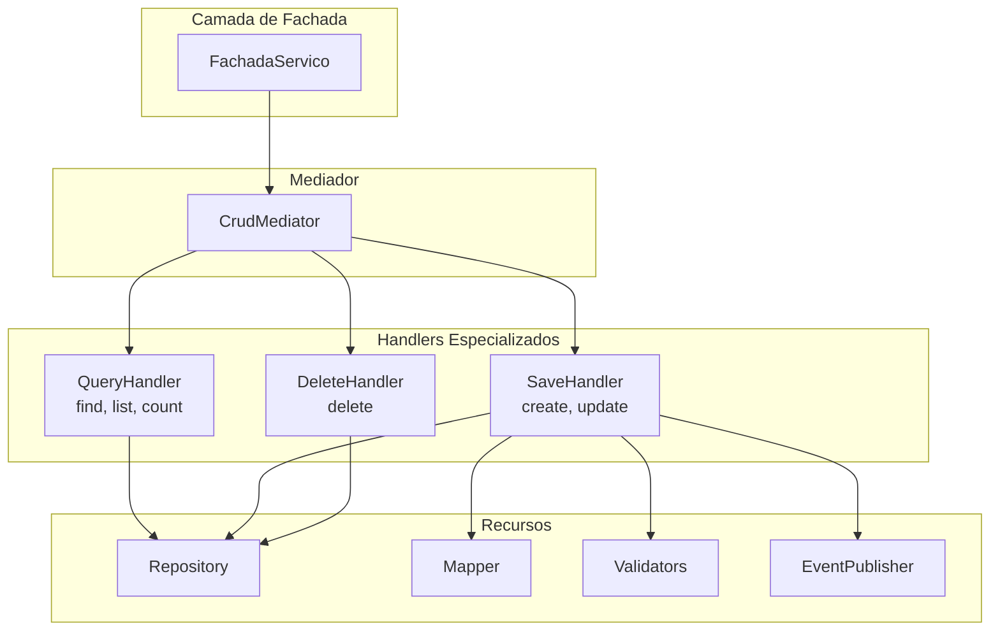

# Análise de Refatoração: DefaultBaseService com Padrão Mediator

## 1. Contexto Atual

### 1.1 Problema Identificado

O [`DefaultBaseService.java`](ia-core/ia-core-service/src/main/java/com/ia/core/service/DefaultBaseService.java) é uma classe "god class" que viola o **Princípio da Responsabilidade Única (SRP)**. Atualmente, esta classe implementa **5 interfaces** diferentes:

```java
public abstract class DefaultBaseService<T extends BaseEntity, D extends DTO<T>>
  extends AbstractBaseService<T, D>
  implements CountBaseService<T, D>, 
             DeleteBaseService<T, D>,
             FindBaseService<T, D>, 
             ListBaseService<T, D>, 
             SaveBaseService<T, D>,
             CrudUseCase<D>
```

### 1.2 Interfaces Atuais

| Interface | Responsabilidade |
|-----------|-----------------|
| `CountBaseService` | Contagem de entidades |
| `DeleteBaseService` | Exclusão de entidades |
| `FindBaseService` | Busca por ID |
| `ListBaseService` | Listagem com paginação |
| `SaveBaseService` | Salvamento (create/update) |
| `CrudUseCase` | Interface unificada de CRUD |

### 1.3 Impacto Atual

**Serviços afetados:**
- **ia-core-apps**: 8 serviços extendem `DefaultBaseService`
- **gestor-igreja**: 64 serviços extendem `DefaultSecuredBaseService` ( subclasse)
- **Total**: ~72 serviços dependentes

---

## 2. Solução Proposta: Padrão Mediator

### 2.1 Conceito

O **Padrão Mediator** define um objeto que encapsula como um conjunto de objetos interage. Em vez de os serviços se comunicarem diretamente, eles enviam mensagens através de um mediador.

### 2.2 Arquitetura Proposta



### 2.3 Componentes da Arquitetura

#### 2.3.1 Commands (Requisições)

```java
// Command base
public sealed interface CrudCommand<D> permits 
    FindByIdCommand,
    FindAllCommand,
    CountCommand,
    SaveCommand,
    DeleteCommand {
    
    D getPayload();
}

// Exemplo: Command para busca por ID
public record FindByIdCommand<D>(Long id) implements CrudCommand<D> {}
```

#### 2.3.2 Handlers (Processadores)

```java
// Handler base
public interface CrudHandler<C extends CrudCommand<R>, R> {
    R handle(C command);
}

// Query Handler
@Component
public class QueryHandler<D extends DTO<?>>
    implements FindHandler<D>, ListHandler<D>, CountHandler<D> {
    
    private final BaseEntityRepository<?, D> repository;
    private final BaseEntityMapper<?, D> mapper;
    
    @Override
    public D handle(FindByIdCommand<D> command) {
        return repository.findById(command.id())
            .map(mapper::toDto)
            .orElse(null);
    }
    
    @Override
    public Page<D> handle(FindAllCommand<D> command) {
        // implementação
    }
}

// Save Handler
@Component
public class SaveHandler<D extends DTO<?>>
    implements CreateHandler<D>, UpdateHandler<D> {
    
    private final BaseEntityRepository<?, D> repository;
    private final BaseEntityMapper<?, D> mapper;
    private final List<IServiceValidator<D>> validators;
    
    @Override
    public D handle(SaveCommand<D> command) {
        // 1. Validar
        validators.forEach(v -> v.validate(command.dto()));
        
        // 2. Mapear para entidade
        Entity entity = mapper.toEntity(command.dto());
        
        // 3. Salvar
        Entity saved = repository.save(entity);
        
        // 4. Mapear de volta para DTO
        return mapper.toDto(saved);
    }
}
```

#### 2.3.3 Mediador (Orquestrador)

```java
@Service
@Primary
public class CrudMediator<D extends DTO<?>> {
    
    private final QueryHandler<D> queryHandler;
    private final SaveHandler<D> saveHandler;
    private final DeleteHandler<D> deleteHandler;
    
    public D find(Long id) {
        return queryHandler.handle(new FindByIdCommand<>(id));
    }
    
    public Page<D> findAll(SearchRequestDTO request) {
        return queryHandler.handle(new FindAllCommand<>(request));
    }
    
    public D save(D dto) {
        return saveHandler.handle(new SaveCommand<>(dto));
    }
    
    public void delete(Long id) {
        deleteHandler.handle(new DeleteCommand<>(id));
    }
}
```

### 2.4 Benefícios da Arquitetura

| Aspecto | Antes | Depois |
|----------|-------|--------|
| **Acoplamento** | Alto (classe god) | Baixo (handlers especializados) |
| **Testabilidade** | Difícil | Cada handler testável isoladamente |
| **Manutenção** | Risco de regressão | Mudanças isoladas |
| **Extensão** | Modificar classe base | Criar novo handler |
| **SRP** | Violado | Cada handler com uma responsabilidade |

---

## 3. Plano de Migração

### 3.1 Fase 1: Criar Nova Estrutura

1. Criar package `com.ia.core.service.mediator`
2. Criar interfaces de Command
3. Criar Handlers especializados
4. Criar CrudMediator

### 3.2 Fase 2: Migrar DefaultBaseService

```java
// Novo DefaultBaseService usando o Mediator
public abstract class DefaultBaseService<T extends BaseEntity, D extends DTO<T>>
    extends AbstractBaseService<T, D> {
    
    private final CrudMediator<D> mediator;
    
    public D find(Long id) {
        return mediator.find(id);
    }
    
    public Page<D> findAll(SearchRequestDTO request) {
        return mediator.findAll(request);
    }
    
    public D save(D dto) {
        return mediator.save(dto);
    }
    
    public void delete(Long id) {
        mediator.delete(id);
    }
}
```

### 3.3 Fase 3: Atualizar Configurações

Cada `*ServiceConfig` precisará expor os Handlers como beans do Spring:

```java
@Configuration
public class PessoaServiceConfig 
    extends DefaultSecuredBaseServiceConfig<Pessoa, PessoaDTO> {
    
    @Bean
    public QueryHandler<PessoaDTO> pessoaQueryHandler() {
        return new QueryHandler<>(pessoaRepository(), pessoaMapper());
    }
    
    @Bean
    public SaveHandler<PessoaDTO> pessoaSaveHandler() {
        return new SaveHandler<>(pessoaRepository(), pessoaMapper(), validators());
    }
}
```

### 3.4 Fase 4: Testes e Validação

1. Criar testes unitários para cada Handler
2. Testar integração com serviços existentes
3. Validar publicação de eventos

---

## 4. Riscos e Mitigações

| Risco | Impacto | Mitigação |
|-------|---------|-----------|
| Quebra de compatibilidade | Alto | Manter DefaultBaseService como deprecated temporariamente |
| Performance | Médio | Medir latência do mediator em ambiente de teste |
| Complexidade inicial | Médio | Documentação clara e exemplos |

---

## 5. Conclusão

A refatoração usando **Padrão Mediator** oferece:

1. **Separação clara de responsabilidades** - Cada handler faz uma coisa
2. **Alta testabilidade** - Handlers podem ser testados isoladamente
3. **Facilidade de extensão** - Novos comandos/handlers sem modificar código existente
4. **Melhor manutenção** - Mudanças isoladas reduzem risco de regressão

O impacto é significativo (~72 serviços), mas a migração pode ser feita de forma incremental, mantendo compatibilidade temporária.

---

**Recomendação**: Implementar em fases, começando pelos Handlers (nova estrutura) e gradualmente migrando os serviços existentes.
